# Brick Connection Guide

This guide visualizes how Quantum Lego bricks connect together like puzzle pieces to build complex computational workflows.

## Table of Contents

1. [Overview: All 13 Brick Types](#overview-all-13-brick-types)
2. [Port Type System](#port-type-system)
3. [Basic Sequential Patterns](#basic-sequential-patterns)
4. [Advanced Workflows](#advanced-workflows)
5. [Batch and Analysis Patterns](#batch-and-analysis-patterns)
6. [Multi-Code Workflows](#multi-code-workflows)
7. [Connection Rules](#connection-rules)

---

## Overview: All 13 Brick Types

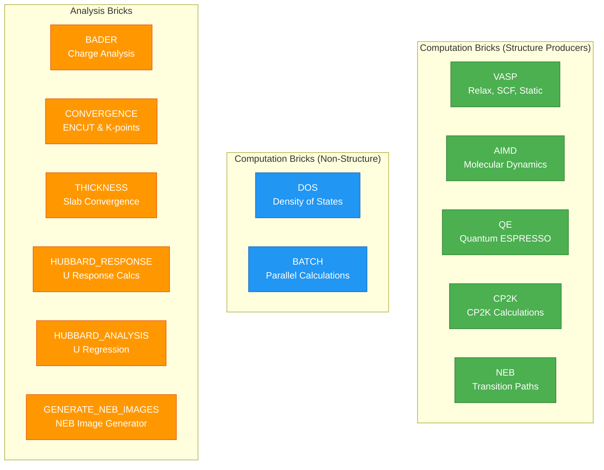

**Legend:**
- 🟢 **Green**: Computation bricks that produce structure outputs
- 🔵 **Blue**: Computation bricks without structure outputs
- 🟠 **Orange**: Analysis bricks

---

## Port Type System

The brick connection system uses 15 typed ports for data flow:

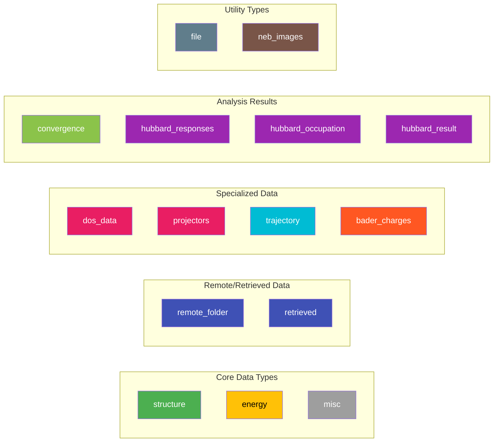

---

## Basic Sequential Patterns

### Pattern 1: VASP Relaxation Chain

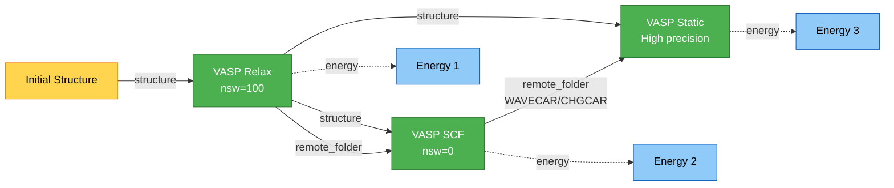

**Key Features:**
- `structure_from`: Connect structures between stages
- `restart`: Reuse WAVECAR/CHGCAR for faster convergence
- Each stage produces independent energy

---

### Pattern 2: DOS Calculation

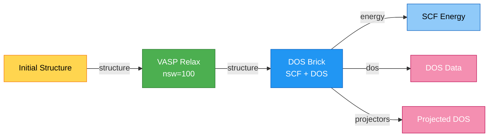

**Configuration:**
```python
stages = [
    {
        'name': 'relax',
        'type': 'vasp',
        'incar': {'nsw': 100, 'ibrion': 2},
        'restart': None,
    },
    {
        'name': 'dos_calc',
        'type': 'dos',
        'structure_from': 'relax',  # Connection!
        'scf_incar': {'encut': 520, 'ediff': 1e-6},
        'dos_incar': {'nedos': 2000, 'lorbit': 11},
    },
]
```

---

### Pattern 3: Batch Parallel Calculations

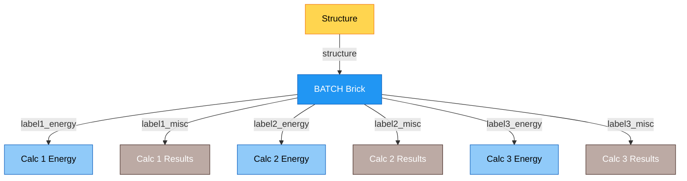

**Use Case:** Test multiple INCAR parameters in parallel (e.g., ENCUT convergence)

---

## Advanced Workflows

### Pattern 4: Bader Charge Analysis

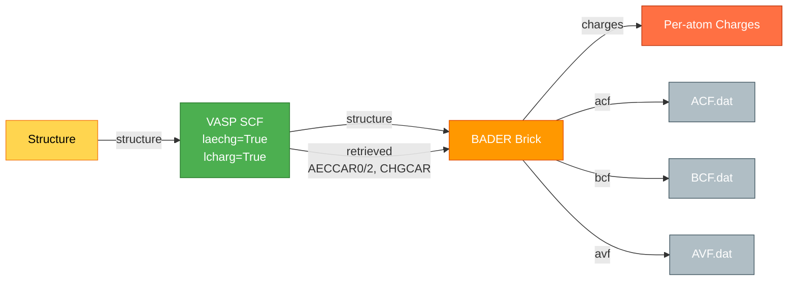

**Prerequisites:** VASP stage must have:
- `incar`: `{'laechg': True, 'lcharg': True}`
- `retrieve`: `['AECCAR0', 'AECCAR2', 'CHGCAR', 'OUTCAR']`

---

### Pattern 5: Hubbard U Calculation

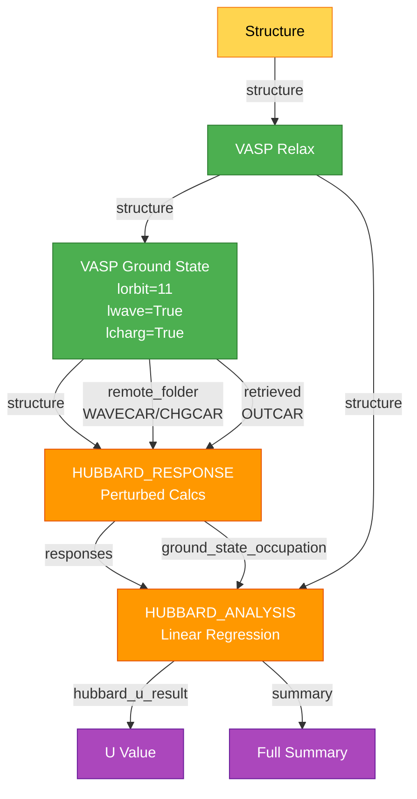

**Configuration:**
```python
stages = [
    {'name': 'relax', 'type': 'vasp', 'incar': {...}, 'restart': None},
    {
        'name': 'ground_state',
        'type': 'vasp',
        'structure_from': 'relax',
        'incar': {'nsw': 0, 'lorbit': 11, 'lwave': True, 'lcharg': True},
        'restart': None,
    },
    {
        'name': 'response',
        'type': 'hubbard_response',
        'ground_state_from': 'ground_state',  # Connection!
        'structure_from': 'relax',
        'target_species': 'Sn',
        'potential_values': [-0.2, -0.1, 0.1, 0.2],
    },
    {
        'name': 'analysis',
        'type': 'hubbard_analysis',
        'response_from': 'response',  # Connection!
        'structure_from': 'relax',
        'target_species': 'Sn',
    },
]
```

---

### Pattern 6: NEB Transition Path

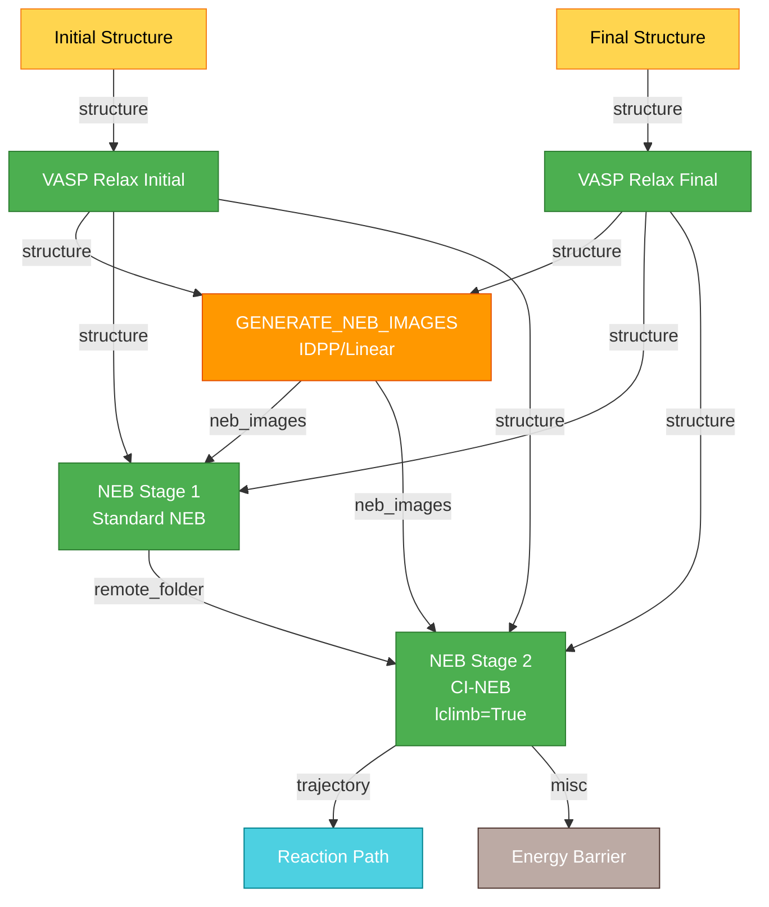

**Key Points:**
- `generate_neb_images` creates intermediate structures
- NEB stages can be chained via `restart`
- `images_from` connects to generator OR `images_dir` for manual images

---

### Pattern 7: AIMD Chain

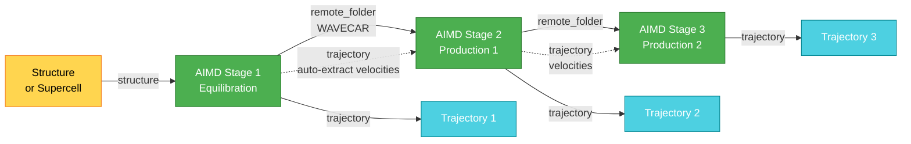

**Features:**
- Velocities automatically extracted from previous trajectory
- `restart` reuses WAVECAR for efficiency
- Trajectories can be concatenated for analysis

---

## Batch and Analysis Patterns

### Pattern 8: Convergence Testing

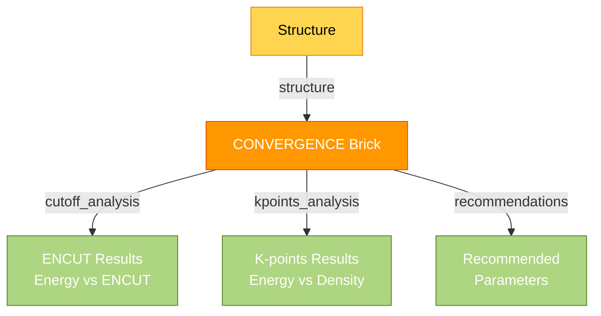

**Auto-Tests:**
- ENCUT: Multiple values tested
- K-points: Multiple densities tested
- Produces convergence plots and recommendations

---

### Pattern 9: Thickness Convergence

```mermaid
graph TB
    subgraph "Option A: Standalone"
        INPUT1[Bulk Structure] -->|structure| THICK1[THICKNESS Brick<br/>Auto-compute bulk]
        THICK1 -->|convergence_results| RES1[Surface Energy vs<br/>Layer Count]
    end

    subgraph "Option B: With VASP Bulk"
        INPUT2[Bulk Structure] -->|structure| BULK[VASP Bulk Calc]
        BULK -->|structure| THICK2[THICKNESS Brick]
        BULK -->|energy| THICK2
        THICK2 -->|convergence_results| RES2[Surface Energy vs<br/>Layer Count]
    end

    style THICK1 fill:#FF9800,stroke:#E65100,color:#fff
    style THICK2 fill:#FF9800,stroke:#E65100,color:#fff
    style BULK fill:#4CAF50,stroke:#2E7D32,color:#fff
    style INPUT1 fill:#FFD54F,stroke:#F57F17,color:#000
    style INPUT2 fill:#FFD54F,stroke:#F57F17,color:#000
    style RES1 fill:#AED581,stroke:#558B2F,color:#fff
    style RES2 fill:#AED581,stroke:#558B2F,color:#fff
```

**Configuration:**
```python
# Option B example
stages = [
    {
        'name': 'bulk',
        'type': 'vasp',
        'incar': {'nsw': 100, 'ibrion': 2, 'isif': 3},
        'restart': None,
    },
    {
        'name': 'thickness',
        'type': 'thickness',
        'structure_from': 'bulk',  # Uses relaxed bulk
        'energy_from': 'bulk',     # Uses bulk energy
        'miller_indices': [1, 1, 0],
        'layer_counts': [3, 4, 5, 6, 7],
        'vacuum': 15.0,
        'incar': {'nsw': 100, 'ibrion': 2},
    },
]
```

---

## Multi-Code Workflows

### Pattern 10: Quantum ESPRESSO

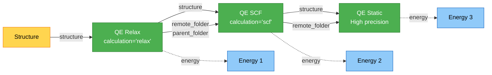

---

### Pattern 11: CP2K

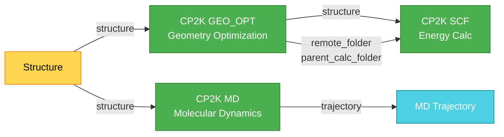

---

## Connection Rules

### 1. Source Resolution Modes

| Mode | Description | Example |
|------|-------------|---------|
| `auto` | General mode for structure-bearing bricks: resolves structure from `structure_from` (defaulting to `previous`/`input` when absent) | `'source': 'auto'` → uses `structure_from` or falls back to previous/input |
| `structure_from` | Reference structure from named stage | `'structure_from': 'relax'` |
| `energy_from` | Reference energy from named stage | `'energy_from': 'scf'` |
| `charge_from` | Bader: reference VASP charge stage | `'charge_from': 'scf'` |
| `ground_state_from` | Hubbard: reference ground state VASP | `'ground_state_from': 'gs'` |
| `response_from` | Hubbard analysis: reference response | `'response_from': 'response'` |
| `restart` | Reuse remote folder (WAVECAR/CHGCAR) | `'restart': 'previous_stage'` |
| `initial_from` / `final_from` | NEB endpoints | `'initial_from': 'relax_i'` |
| `images_from` | NEB images from generator | `'images_from': 'gen_images'` |

---

### 2. Type Compatibility Matrix

| Output Port Type | Compatible Input Port Types |
|-----------------|----------------------------|
| `structure` | `structure` |
| `energy` | `energy` |
| `remote_folder` | `remote_folder`, `restart_folder` |
| `retrieved` | `retrieved`, `charge_files` |
| `dos_data` | `dos_data` |
| `trajectory` | `trajectory` |
| `hubbard_responses` | `hubbard_responses` |
| `neb_images` | `neb_images` |

**Rule:** Input port type must exactly match output port type.

---

### 3. Brick Compatibility Constraints

Some inputs can only connect to specific brick types:

| Input Port | Allowed Source Bricks |
|-----------|----------------------|
| `bader.charge_files` | `vasp` |
| `bader.structure` | `vasp` |
| `hubbard_response.ground_state_remote` | `vasp` |
| `hubbard_analysis.responses` | `hubbard_response` |
| `generate_neb_images.initial_structure` | `vasp` |
| `neb.initial_structure` | `vasp` |
| `neb.images` | `generate_neb_images` |
| `thickness.energy` | `vasp` |

---

### 4. Prerequisite Validation

Some connections require specific INCAR settings and retrieved files:

#### Bader Analysis Prerequisites:
```python
# Source VASP stage must have:
'incar': {
    'laechg': True,
    'lcharg': True,
}
'retrieve': ['AECCAR0', 'AECCAR2', 'CHGCAR', 'OUTCAR']
```

#### Hubbard Response Prerequisites:
```python
# Ground state VASP must have:
'incar': {
    'lorbit': 11,
    'lwave': True,
    'lcharg': True,
}
'retrieve': ['OUTCAR']  # For occupation numbers
```

---

### 5. Conditional Outputs

Some outputs are only meaningful under certain conditions:

| Brick | Output | Condition |
|-------|--------|-----------|
| VASP | `structure` | `nsw > 0` (relaxation/MD) |
| QE | `structure` | `calculation in ['relax', 'vc-relax']` |
| CP2K | `structure` | `RUN_TYPE in ['GEO_OPT', 'CELL_OPT', 'MD']` |
| CP2K | `trajectory` | `RUN_TYPE == 'MD'` |

**Warnings:** The validation system warns if you reference a potentially meaningless output (e.g., structure from `nsw=0` static calc).

---

### 6. Validation Before Submission

Call `validate_connections()` to check all connections:

```python
from quantum_lego.core.bricks import validate_connections

stages = [
    {'name': 'relax', 'type': 'vasp', ...},
    {'name': 'dos', 'type': 'dos', 'structure_from': 'relax', ...},
]

warnings = validate_connections(stages)
# Returns list of warning strings (empty if OK)
# Raises ValueError if connections are invalid
```

**What it checks:**
1. ✓ Port type compatibility
2. ✓ Referenced stages exist
3. ✓ Brick compatibility constraints
4. ✓ Prerequisites (INCAR settings, retrieve lists)
5. ⚠ Conditional output warnings

---

## Quick Reference: Brick Capabilities

| Brick | Input Structure | Output Structure | Output Energy | Output Trajectory | Requires Prior VASP | Chainable |
|-------|----------------|------------------|---------------|-------------------|---------------------|-----------|
| **vasp** | Yes | Yes* | Yes | No | No | Via `restart` |
| **dos** | From stage | No | Yes (SCF) | No | Yes | No |
| **batch** | From stage | No | Yes (per-calc) | No | Yes | No |
| **bader** | From stage | No | No | No | Yes | No |
| **convergence** | Optional | No | No | No | No | No |
| **thickness** | Optional | No | No | No | No | No |
| **hubbard_response** | From stage | No | No | No | Yes (ground state) | No |
| **hubbard_analysis** | From stage | No | No | No | No (uses response data) | No |
| **aimd** | Yes | Yes | Yes | Yes | No | Via `restart` |
| **qe** | Yes | Yes* | Yes | No | No | Via `restart` |
| **cp2k** | Yes | Yes* | Yes | Yes* | No | Via `restart` |
| **generate_neb_images** | 2x from VASP | No | No | No | Yes (endpoints) | No |
| **neb** | 2x from VASP | Yes | No | Yes | Yes (endpoints) | Via `restart` |

\* Conditional on calculation type (see [Conditional Outputs](#5-conditional-outputs))

---

## Examples from Codebase

### Example 1: Full VASP → DOS Pipeline

```python
from quantum_lego import quick_vasp_sequential

stages = [
    {
        'name': 'relax',
        'type': 'vasp',
        'incar': {'nsw': 100, 'ibrion': 2, 'isif': 3, 'encut': 520},
        'kpoints_spacing': 0.05,
        'restart': None,
    },
    {
        'name': 'scf',
        'type': 'vasp',
        'structure_from': 'relax',  # Use relaxed structure
        'incar': {'nsw': 0, 'encut': 520, 'lwave': True, 'lcharg': True},
        'kpoints_spacing': 0.03,
        'restart': 'relax',  # Reuse WAVECAR
    },
    {
        'name': 'dos',
        'type': 'dos',
        'structure_from': 'relax',  # Use relaxed structure
        'scf_incar': {'encut': 520, 'ediff': 1e-6},
        'dos_incar': {'nedos': 2000, 'lorbit': 11, 'ismear': -5},
        'kpoints_spacing': 0.03,
        'dos_kpoints_spacing': 0.02,
    },
]

result = quick_vasp_sequential(
    structure=structure,
    code_label='VASP-6.5.1@localwork',
    stages=stages,
    potential_family='PBE',
    potential_mapping={'Sn': 'Sn_d', 'O': 'O'},
    options={'resources': {'num_machines': 1, 'num_mpiprocs_per_machine': 8}},
)
```

---

### Example 2: Complete Hubbard U Workflow

```python
stages = [
    {
        'name': 'relax',
        'type': 'vasp',
        'incar': {'nsw': 50, 'ibrion': 2, 'isif': 2, 'encut': 520},
        'restart': None,
    },
    {
        'name': 'ground_state',
        'type': 'vasp',
        'structure_from': 'relax',
        'incar': {
            'nsw': 0,
            'encut': 520,
            'lorbit': 11,  # Required for occupations
            'lwave': True,  # Required for restart
            'lcharg': True,  # Required for restart
        },
        'restart': None,
    },
    {
        'name': 'response',
        'type': 'hubbard_response',
        'ground_state_from': 'ground_state',  # Where to get WAVECAR/CHGCAR
        'structure_from': 'relax',            # Where to get structure
        'target_species': 'Sn',
        'target_orbitals': 'd',
        'potential_values': [-0.2, -0.1, 0.1, 0.2],  # Perturbation potentials
        'nscf_incar': {'nelm': 1},           # NSCF settings
        'scf_incar': {'ediff': 1e-6},        # SCF settings
    },
    {
        'name': 'analysis',
        'type': 'hubbard_analysis',
        'response_from': 'response',          # Where to get response data
        'structure_from': 'relax',            # Where to get structure
        'target_species': 'Sn',
    },
]
```

---

### Example 3: NEB with Image Generation

```python
stages = [
    {
        'name': 'relax_initial',
        'type': 'vasp',
        'incar': {'nsw': 80, 'ibrion': 2, 'ediffg': -0.02},
        'restart': None,
    },
    {
        'name': 'relax_final',
        'type': 'vasp',
        'incar': {'nsw': 80, 'ibrion': 2, 'ediffg': -0.02},
        'restart': None,
    },
    {
        'name': 'make_images',
        'type': 'generate_neb_images',
        'initial_from': 'relax_initial',
        'final_from': 'relax_final',
        'n_images': 5,
        'method': 'idpp',  # Better than linear
    },
    {
        'name': 'neb_stage_1',
        'type': 'neb',
        'initial_from': 'relax_initial',
        'final_from': 'relax_final',
        'images_from': 'make_images',  # Use generated images
        'incar': {'ibrion': 3, 'potim': 0.0, 'iopt': 1, 'ediffg': -0.05},
        'restart': None,
    },
    {
        'name': 'neb_stage_2_ci',
        'type': 'neb',
        'initial_from': 'relax_initial',
        'final_from': 'relax_final',
        'images_from': 'make_images',  # Reuse same images
        'incar': {'lclimb': True, 'ibrion': 3, 'ediffg': -0.02},  # Climbing image
        'restart': 'neb_stage_1',  # Restart from previous NEB
    },
]
```

---

## Summary

The Quantum Lego brick system provides:

1. **13 Brick Types**: 5 structure-producing, 2 non-structure computation, 6 analysis
2. **14 Port Types**: Typed data flow with validation
3. **9 Source Modes**: Flexible connection patterns
4. **Automatic Validation**: Type checking, prerequisite checking, warning system
5. **Common Patterns**: Sequential, batch, restart chaining, multi-stage analysis

**Key Principle:** Bricks connect like Lego pieces through typed ports, with validation ensuring compatible connections before submission.

For implementation details, see:
- Port declarations: `quantum_lego/core/bricks/connections.py`
- Brick implementations: `quantum_lego/core/bricks/*.py`
- Examples: `examples/` directory
- Developer guide: `AGENTS.md`
