# Quantum Lego Documentation

**Build computational workflows like Lego blocks!**

Quantum Lego is a modular Python framework for building and composing computational chemistry workflows using AiiDA. It provides intuitive "brick" building blocks that can be connected together to create complex multi-stage calculations.

## Table of Contents

- [Quick Start](#quick-start)
- [Core Concepts](#core-concepts)
- [Brick Types](#brick-types)
- [Sequential Workflows](#sequential-workflows)
- [Batch Operations](#batch-operations)
- [Examples](#examples)
- [Advanced Topics](#advanced-topics)

---

## Quick Start

### Installation

```bash
pip install -e /path/to/quantum-lego
```

### Your First Calculation

```python
from quantum_lego import quick_vasp, get_results, get_status
from aiida import orm, load_profile
from ase.io import read

# Load AiiDA profile
load_profile()

# Load structure
structure = orm.StructureData(ase=read('structure.vasp'))

# Run a simple VASP relaxation
pk = quick_vasp(
    structure=structure,
    code_label='VASP-6.5.1@localwork',
    incar={'NSW': 100, 'IBRION': 2, 'ENCUT': 400},
    kpoints_spacing=0.03,
    potential_family='PBE',
    potential_mapping={'Si': 'Si'},
    options={'resources': {'num_machines': 1, 'num_mpiprocs_per_machine': 8}},
    name='si_relax',
)

# Check status
status = get_status(pk)  # -> 'running', 'finished', 'failed'

# Get results when finished
results = get_results(pk)
print(f"Energy: {results['energy']:.4f} eV")
print(f"Formula: {results['structure'].get_formula()}")
```

---

## Core Concepts

### The Brick System

Quantum Lego uses a **brick-based architecture** where each "brick" represents a type of calculation or workflow step. Bricks can be connected together like Lego pieces to build complex multi-stage workflows.

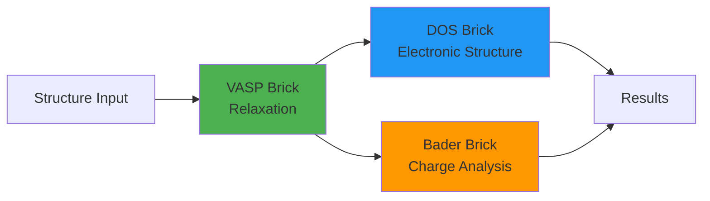

### Key Design Principles

1. **Incremental**: Run one step at a time, inspect results, decide what's next
2. **Modular**: Each brick has well-defined inputs and outputs
3. **Type-safe**: Port validation ensures correct connections between bricks
4. **Flexible**: No presets - you control all parameters explicitly

### Port System

Each brick has typed **input** and **output ports** that define what data flows in and out:

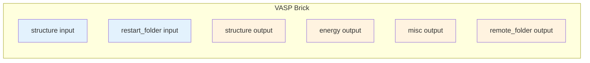

**Port Types:**
- `structure` - Atomic structures (StructureData)
- `energy` - Total energies (float)
- `misc` - Parsed calculation results (dict)
- `remote_folder` - Remote calculation directory (RemoteData)
- `retrieved` - Retrieved output files (FolderData)
- `dos_data` - Density of states data
- `trajectory` - AIMD trajectories
- `convergence` - Convergence test results
- `bader_charges` - Bader charge analysis results
- And more...

### Connection Validation

Quantum Lego validates all connections **before submission** to catch errors early:

```python
from quantum_lego import quick_vasp_sequential

stages = [
    {
        'name': 'relax',
        'type': 'vasp',
        'incar': {'NSW': 100, 'IBRION': 2},
    },
    {
        'name': 'dos',
        'type': 'dos',
        'structure_from': 'relax',  # ✓ Valid: connects to relaxed structure
        'scf_incar': {'ENCUT': 400},
        'dos_incar': {'NEDOS': 2000},
    },
]

result = quick_vasp_sequential(structure, stages=stages, ...)
# Validation happens automatically before submission!
```

---

## Brick Types

Quantum Lego provides **13 brick types** for different calculation workflows. Each brick follows the same pattern:

```python
# Each brick exports:
PORTS                    # Input/output port declarations
validate_stage()         # Stage-specific validation
create_stage_tasks()     # Build WorkGraph tasks
expose_stage_outputs()   # Wire outputs
get_stage_results()      # Extract results
print_stage_results()    # Format output
```

### 1. VASP Brick (`vasp`)

Standard VASP calculation for relaxations, static SCF, and more.

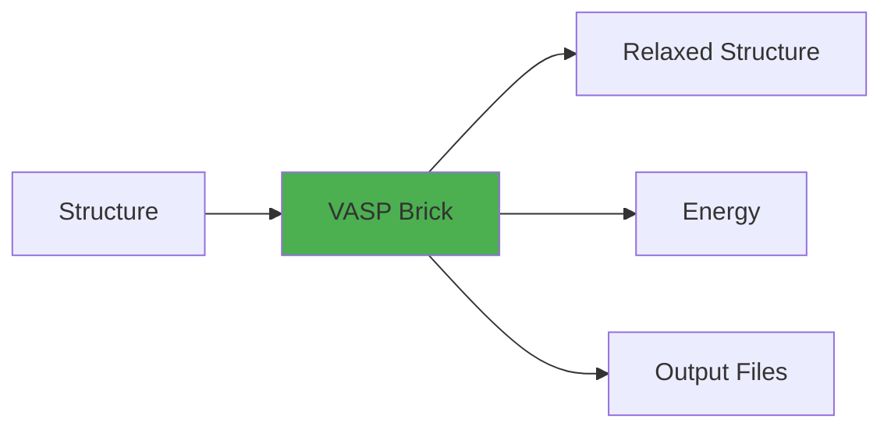

**Use cases:** Geometry optimization, static SCF, band structure calculations

**Example:**
```python
from quantum_lego import quick_vasp

pk = quick_vasp(
    structure=structure,
    code_label='VASP-6.5.1@localwork',
    incar={'NSW': 100, 'IBRION': 2, 'ENCUT': 520},
    kpoints_spacing=0.03,
    potential_family='PBE',
    potential_mapping={'Sn': 'Sn_d', 'O': 'O'},
    options={'resources': {'num_machines': 1, 'num_mpiprocs_per_machine': 8}},
    retrieve=['CHGCAR', 'WAVECAR'],  # Extra files beyond defaults
    name='sno2_relax',
)
```

**Key INCAR parameters:**
- `NSW`: Number of ionic steps (0=static, >0=relaxation)
- `IBRION`: Ionic relaxation method (2=conjugate gradient)
- `ISIF`: Stress/relaxation flag (2=ions only, 3=ions+cell)
- `ENCUT`: Plane-wave cutoff energy (eV)

### 2. DOS Brick (`dos`)

Density of states calculation using BandsWorkChain (automatic SCF + DOS chain).

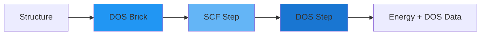

**Use cases:** Electronic structure analysis, band gap calculations, projected DOS

**Example:**
```python
from quantum_lego import quick_dos, get_dos_results

pk = quick_dos(
    structure=structure,
    code_label='VASP-6.5.1@localwork',
    scf_incar={'encut': 400, 'ediff': 1e-6, 'ismear': 0},
    dos_incar={'nedos': 2000, 'lorbit': 11, 'ismear': -5},
    kpoints_spacing=0.03,
    dos_kpoints_spacing=0.02,  # Denser k-mesh for DOS
    potential_family='PBE',
    potential_mapping={'Sn': 'Sn_d', 'O': 'O'},
    options={'resources': {'num_machines': 1, 'num_mpiprocs_per_machine': 8}},
    retrieve=['DOSCAR', 'PROCAR'],
    name='sno2_dos',
)

# Get results
results = get_dos_results(pk)
print(f"SCF Energy: {results['energy']:.4f} eV")
```

**Note:** AiiDA-VASP requires lowercase INCAR keys for the DOS brick.

### 3. Batch Brick (`batch`)

Run multiple VASP calculations in parallel with per-structure parameter variations.

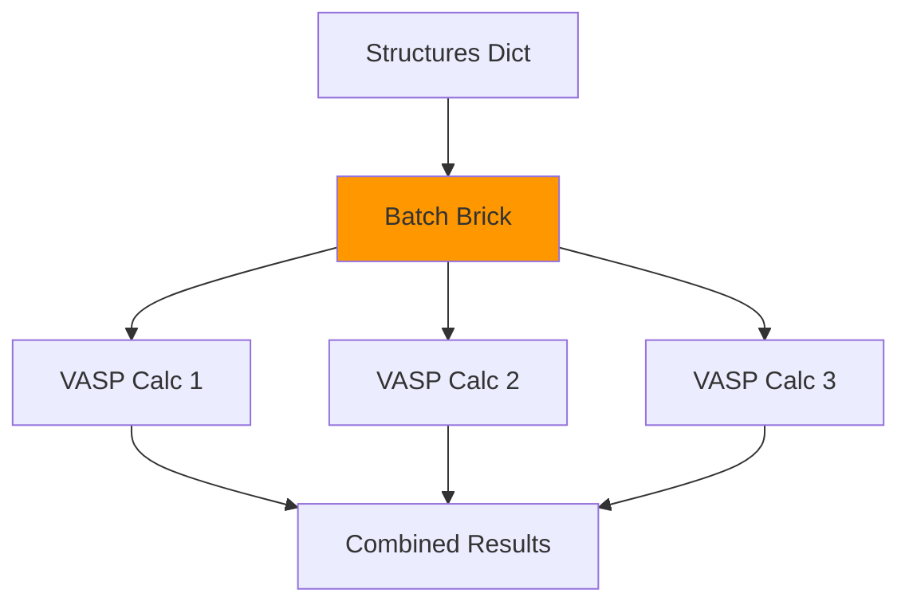

**Use cases:** Fukui analysis, defect calculations, parameter screening

**Example:**
```python
from quantum_lego import quick_vasp_batch, get_batch_results

# Multiple structures with individual INCAR overrides
structures = {
    'neutral': structure,
    'charged_plus': structure,
    'charged_minus': structure,
}

incar_overrides = {
    'charged_plus': {'NELECT': 191.95},   # +0.05e charge
    'charged_minus': {'NELECT': 192.05},  # -0.05e charge
}

result = quick_vasp_batch(
    structures=structures,
    code_label='VASP-6.5.1@localwork',
    incar={'NSW': 0, 'ENCUT': 400},  # Base INCAR
    incar_overrides=incar_overrides,
    kpoints_spacing=0.03,
    potential_family='PBE',
    potential_mapping={'Sn': 'Sn_d', 'O': 'O'},
    options={'resources': {'num_machines': 1, 'num_mpiprocs_per_machine': 8}},
    max_concurrent_jobs=4,
    name='fukui_batch',
)

# Extract results
batch_results = get_batch_results(result)
for key, res in batch_results.items():
    print(f"{key}: E = {res['energy']:.4f} eV")
```

### 4. AIMD Brick (`aimd`)

Ab initio molecular dynamics simulations with trajectory output.

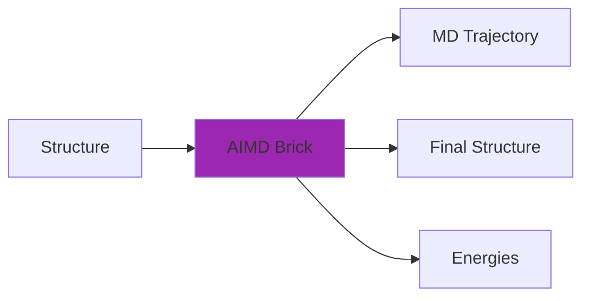

**Use cases:** Finite temperature dynamics, phase transitions, liquid simulations

**Example:**
```python
from quantum_lego import quick_aimd

pk = quick_aimd(
    structure=structure,
    code_label='VASP-6.5.1@localwork',
    incar={
        'IBRION': 0,     # MD
        'NSW': 1000,     # MD steps
        'TEBEG': 300,    # Initial temperature (K)
        'TEEND': 300,    # Final temperature (K)
        'SMASS': 0,      # NVE ensemble (or -1 for Andersen, -3 for Langevin)
        'POTIM': 1.0,    # Time step (fs)
        'ENCUT': 400,
    },
    kpoints_spacing=0.05,
    potential_family='PBE',
    potential_mapping={'Si': 'Si'},
    options={'resources': {'num_machines': 1, 'num_mpiprocs_per_machine': 8}},
    name='si_aimd',
)
```

### 5. Convergence Brick (`convergence`)

Test convergence with respect to ENCUT or k-points.

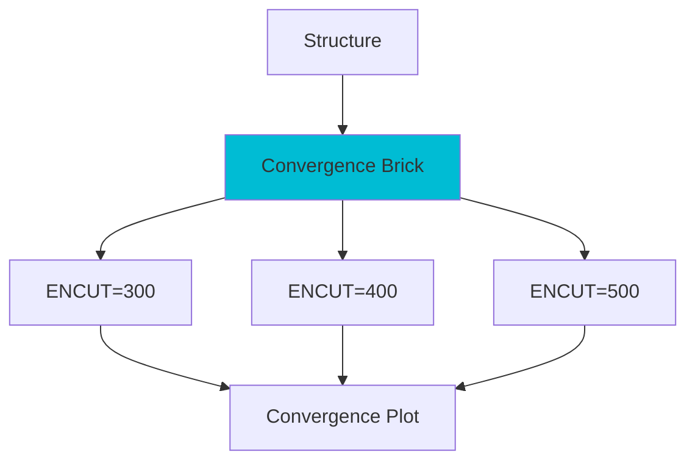

**Use cases:** Finding optimal calculation parameters, systematic parameter studies

**Example:**
```python
from quantum_lego import quick_vasp_sequential

stages = [
    {
        'name': 'conv',
        'type': 'convergence',
        'convergence_type': 'encut',  # or 'kpoints'
        'values': [300, 400, 500, 600],
        'incar': {'NSW': 0, 'PREC': 'Normal'},
        'kpoints_spacing': 0.03,
    },
]

result = quick_vasp_sequential(structure, stages=stages, ...)
```

### 6. Thickness Brick (`thickness`)

Slab thickness convergence testing for surface calculations.

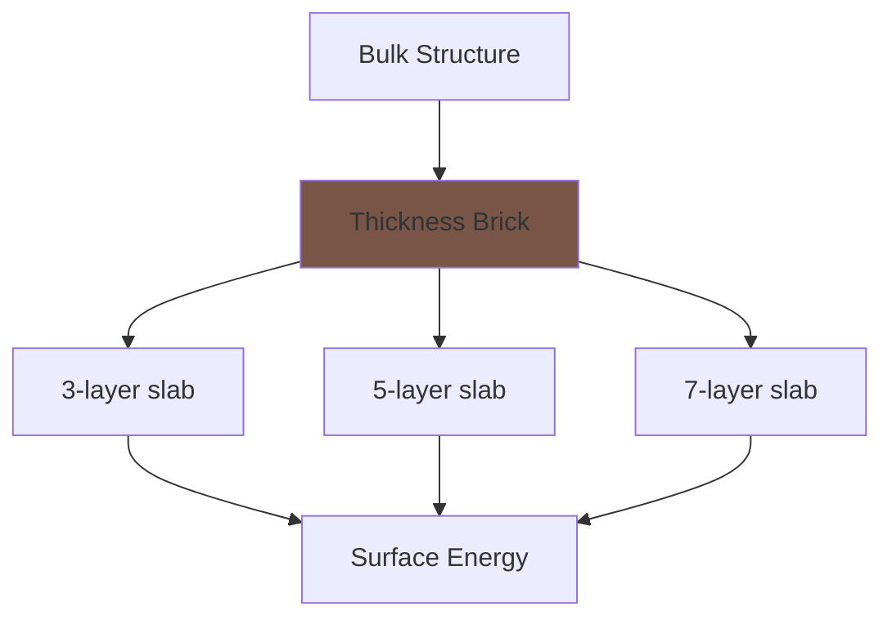

**Use cases:** Surface energy calculations, determining optimal slab thickness

### 7. Bader Brick (`bader`)

Bader charge analysis for electron density partitioning.

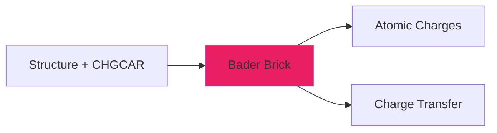

**Use cases:** Charge analysis, oxidation state determination, bonding analysis

### 8. Hubbard U Bricks (`hubbard_response`, `hubbard_analysis`)

Calculate Hubbard U parameters using linear response method.

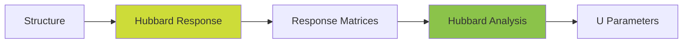

**Use cases:** DFT+U calculations for correlated systems

### 9. NEB Bricks (`generate_neb_images`, `neb`)

Nudged Elastic Band calculations for reaction pathways.

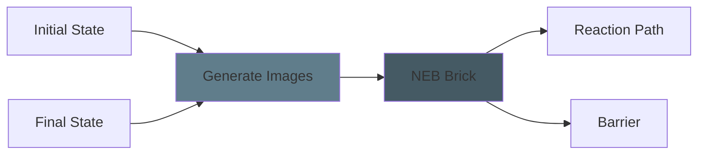

**Use cases:** Transition state search, reaction barrier calculations, diffusion pathways

**Example:**
```python
stages = [
    {'name': 'relax_initial', 'type': 'vasp', 'structure': initial, ...},
    {'name': 'relax_final', 'type': 'vasp', 'structure': final, ...},
    {
        'name': 'make_images',
        'type': 'generate_neb_images',
        'initial_from': 'relax_initial',
        'final_from': 'relax_final',
        'n_images': 5,
    },
    {
        'name': 'neb',
        'type': 'neb',
        'initial_from': 'relax_initial',
        'final_from': 'relax_final',
        'images_from': 'make_images',
        'incar': {'IBRION': 3, 'IOPT': 3, 'SPRING': -5},
    },
]
```

### 10. QE Brick (`qe`)

Quantum ESPRESSO pw.x calculations.

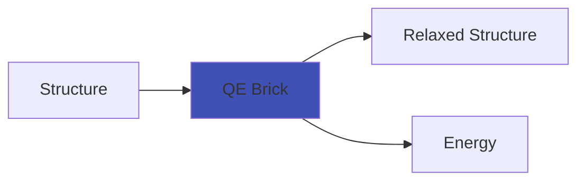

**Use cases:** Alternative DFT code, plane-wave calculations with ultrasoft pseudopotentials

### 11. CP2K Brick (`cp2k`)

CP2K calculations (mixed Gaussian/plane-wave basis).

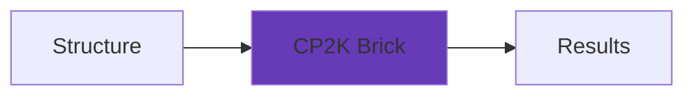

**Use cases:** Large-scale DFT, hybrid functionals, QM/MM simulations

---

## Sequential Workflows

Build multi-stage workflows where each stage can use outputs from previous stages.

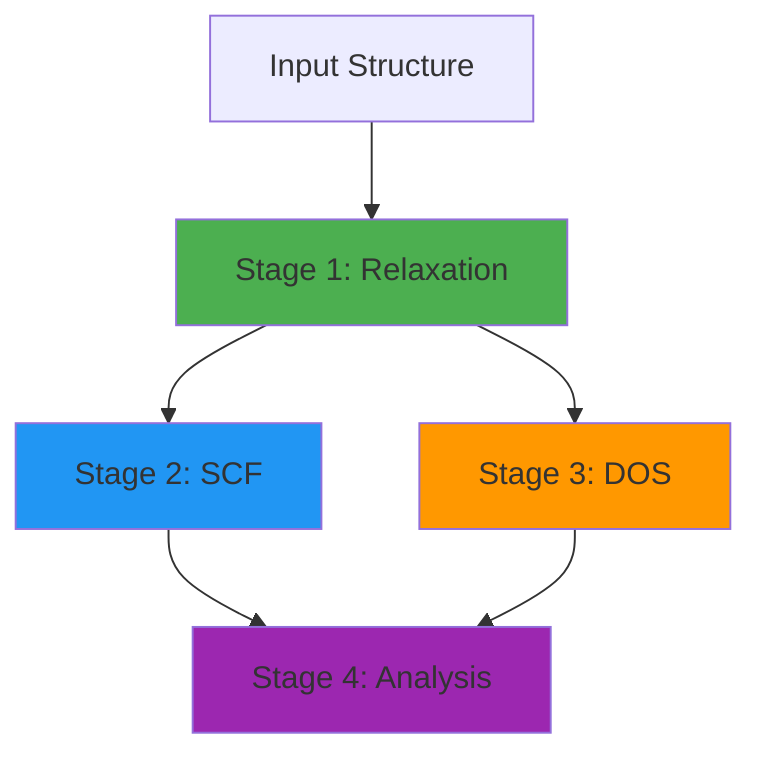

### Basic Sequential Pattern

```python
from quantum_lego import quick_vasp_sequential, print_sequential_results

stages = [
    # Stage 1: Relaxation
    {
        'name': 'relax',
        'type': 'vasp',
        'incar': {'NSW': 100, 'IBRION': 2, 'ISIF': 3, 'ENCUT': 520},
        'kpoints_spacing': 0.03,
        'restart': None,
    },
    # Stage 2: High-quality SCF on relaxed structure
    {
        'name': 'scf',
        'type': 'vasp',
        'structure_from': 'relax',  # Connect to relaxed structure
        'incar': {'NSW': 0, 'ENCUT': 600, 'EDIFF': 1e-7},
        'kpoints_spacing': 0.02,
        'restart': None,
    },
    # Stage 3: DOS on relaxed structure
    {
        'name': 'dos',
        'type': 'dos',
        'structure_from': 'relax',
        'scf_incar': {'encut': 600, 'ediff': 1e-6},
        'dos_incar': {'nedos': 3000, 'lorbit': 11, 'ismear': -5},
        'kpoints_spacing': 0.02,
        'dos_kpoints_spacing': 0.015,
    },
]

result = quick_vasp_sequential(
    structure=initial_structure,
    stages=stages,
    code_label='VASP-6.5.1@localwork',
    potential_family='PBE',
    potential_mapping={'Sn': 'Sn_d', 'O': 'O'},
    options={'resources': {'num_machines': 1, 'num_mpiprocs_per_machine': 8}},
    max_concurrent_jobs=2,  # Run stages in parallel when possible
    name='sno2_sequential',
)

# Monitor
pk = result['__workgraph_pk__']
print(f"WorkGraph PK: {pk}")
print("Monitor: verdi process show", pk)

# Get results when finished
print_sequential_results(result)
```

### Connection Types

**`structure_from`**: Get structure output from another stage
```python
{
    'name': 'dos',
    'type': 'dos',
    'structure_from': 'relax',  # Use relaxed structure
}
```

**`restart`**: Use remote folder (WAVECAR/CHGCAR) from another stage
```python
{
    'name': 'scf',
    'type': 'vasp',
    'structure_from': 'relax',
    'restart': 'relax',  # Continue from relaxation wavefunctions
}
```

**`charge_from`**: Use charge density from another stage
```python
{
    'name': 'bader',
    'type': 'bader',
    'structure_from': 'scf',
    'charge_from': 'scf',  # Use charge density from SCF
}
```

---

## Batch Operations

Run multiple calculations in parallel with systematic parameter variations.

### DOS Batch

```python
from quantum_lego import quick_dos_batch, get_batch_dos_results

structures = {
    'pristine': pristine_structure,
    'defect_1': defect_structure_1,
    'defect_2': defect_structure_2,
}

result = quick_dos_batch(
    structures=structures,
    code_label='VASP-6.5.1@localwork',
    scf_incar={'encut': 400, 'ediff': 1e-6},
    dos_incar={'nedos': 2000, 'lorbit': 11, 'ismear': -5},
    kpoints_spacing=0.03,
    dos_kpoints_spacing=0.02,
    potential_family='PBE',
    potential_mapping={'Sn': 'Sn_d', 'O': 'O'},
    options={'resources': {'num_machines': 1, 'num_mpiprocs_per_machine': 8}},
    max_concurrent_jobs=3,
    name='batch_dos',
)

# Get results
batch_results = get_batch_dos_results(result)
for key, res in batch_results.items():
    print(f"{key}: E = {res['energy']:.4f} eV")
```

### VASP Batch with INCAR Overrides

```python
from quantum_lego import quick_vasp_batch

# Fukui analysis example
N_neutral = 192
delta_values = [0.0, 0.05, 0.10, 0.15]

structures = {f'delta_{d:.2f}': structure for d in delta_values}

incar_overrides = {
    f'delta_{d:.2f}': {'NELECT': N_neutral - d}
    for d in delta_values if d > 0
}

result = quick_vasp_batch(
    structures=structures,
    code_label='VASP-6.5.1@localwork',
    incar={'NSW': 0, 'ENCUT': 400, 'ALGO': 'All'},
    incar_overrides=incar_overrides,
    kpoints_spacing=0.03,
    potential_family='PBE',
    potential_mapping={'Sn': 'Sn_d', 'O': 'O'},
    options={'resources': {'num_machines': 1, 'num_mpiprocs_per_machine': 8}},
    max_concurrent_jobs=2,
    retrieve=['CHGCAR'],
    name='fukui_plus',
)
```

---

## Examples

### Example 1: Simple Relaxation

```python
from quantum_lego import quick_vasp, get_results
from aiida import orm, load_profile
from ase.io import read

load_profile()

structure = orm.StructureData(ase=read('si.vasp'))

pk = quick_vasp(
    structure=structure,
    code_label='VASP-6.5.1@localwork',
    incar={'NSW': 100, 'IBRION': 2, 'ENCUT': 400},
    kpoints_spacing=0.03,
    potential_family='PBE',
    potential_mapping={'Si': 'Si'},
    options={'resources': {'num_machines': 1, 'num_mpiprocs_per_machine': 8}},
    name='si_relax',
)

print(f"Submitted: PK {pk}")
print(f"Monitor: verdi process show {pk}")
```

### Example 2: Relax + DOS

```python
from quantum_lego import quick_vasp_sequential, print_sequential_results

stages = [
    {
        'name': 'relax',
        'type': 'vasp',
        'incar': {'NSW': 100, 'IBRION': 2, 'ENCUT': 520},
    },
    {
        'name': 'dos',
        'type': 'dos',
        'structure_from': 'relax',
        'scf_incar': {'encut': 520, 'ediff': 1e-6},
        'dos_incar': {'nedos': 2000, 'lorbit': 11, 'ismear': -5},
    },
]

result = quick_vasp_sequential(
    structure=structure,
    stages=stages,
    code_label='VASP-6.5.1@localwork',
    potential_family='PBE',
    potential_mapping={'Sn': 'Sn_d', 'O': 'O'},
    options={'resources': {'num_machines': 1, 'num_mpiprocs_per_machine': 8}},
    name='relax_dos',
)

print_sequential_results(result)
```

### Example 3: Convergence Testing

```python
stages = [
    {
        'name': 'convergence',
        'type': 'convergence',
        'convergence_type': 'encut',
        'values': [300, 350, 400, 450, 500, 550, 600],
        'incar': {'NSW': 0, 'PREC': 'Accurate'},
        'kpoints_spacing': 0.03,
    },
]

result = quick_vasp_sequential(
    structure=structure,
    stages=stages,
    code_label='VASP-6.5.1@localwork',
    potential_family='PBE',
    potential_mapping={'Si': 'Si'},
    options={'resources': {'num_machines': 1, 'num_mpiprocs_per_machine': 8}},
    max_concurrent_jobs=4,
    name='encut_convergence',
)
```

### Example 4: NEB Calculation

```python
stages = [
    # Relax endpoints
    {'name': 'relax_initial', 'type': 'vasp', 'structure': initial,
     'incar': {'NSW': 100, 'IBRION': 2, 'ENCUT': 400}},
    {'name': 'relax_final', 'type': 'vasp', 'structure': final,
     'incar': {'NSW': 100, 'IBRION': 2, 'ENCUT': 400}},

    # Generate images
    {
        'name': 'make_images',
        'type': 'generate_neb_images',
        'initial_from': 'relax_initial',
        'final_from': 'relax_final',
        'n_images': 7,  # 7 intermediate images
    },

    # Run NEB
    {
        'name': 'neb',
        'type': 'neb',
        'initial_from': 'relax_initial',
        'final_from': 'relax_final',
        'images_from': 'make_images',
        'incar': {
            'IBRION': 3,
            'IOPT': 3,
            'NSW': 200,
            'SPRING': -5,
            'ENCUT': 400,
        },
    },
]

result = quick_vasp_sequential(
    structure=initial,
    stages=stages,
    code_label='VASP-6.5.1@localwork',
    potential_family='PBE',
    potential_mapping={'O': 'O'},
    options={'resources': {'num_machines': 1, 'num_mpiprocs_per_machine': 8}},
    name='neb_diffusion',
)
```

---

## Advanced Topics

### File Retrieval

Standard VASP files are always retrieved:
- `INCAR`, `KPOINTS`, `POTCAR`, `POSCAR`
- `CONTCAR`, `OUTCAR`, `vasprun.xml`, `OSZICAR`

To retrieve additional files:

```python
pk = quick_vasp(
    structure=structure,
    # ... other parameters ...
    retrieve=['CHGCAR', 'WAVECAR', 'LOCPOT', 'DOSCAR'],
)
```

### Restart Workflows

Use WAVECAR/CHGCAR from previous calculations:

```python
# Run 1: Generate WAVECAR
pk1 = quick_vasp(
    structure=structure,
    incar={'NSW': 100, 'IBRION': 2, 'LWAVE': True},
    name='relax',
)

# Run 2: Continue from WAVECAR
pk2 = quick_vasp(
    restart_from=pk1,  # Auto-loads structure + WAVECAR
    incar={'NSW': 0, 'NEDOS': 2000},
    copy_wavecar=True,
    name='dos',
)
```

### Max Concurrent Jobs

Control parallelism for cluster limitations:

```python
result = quick_vasp_batch(
    structures=structures,
    # ... other parameters ...
    max_concurrent_jobs=4,  # Run max 4 jobs in parallel
)
```

For `localwork` (development), use `max_concurrent_jobs=1` since it runs jobs serially.

### Result Extraction

```python
from quantum_lego import (
    get_results,
    get_energy,
    get_dos_results,
    get_batch_results,
    export_files,
)

# Single calculation
results = get_results(pk)
energy = get_energy(pk)  # Shortcut

# DOS calculation
dos_results = get_dos_results(pk)

# Batch results
batch_results = get_batch_results(result)

# Export files
exported = export_files(pk, output_dir='./results/', files=['CHGCAR', 'DOSCAR'])
```

### Monitoring

```bash
# Show process status
verdi process show <PK>

# Show detailed report
verdi process report <PK>

# List recent calculations
verdi process list -a -p 1

# View daemon logs
verdi daemon logshow
```

### Custom Structures

```python
from ase.io import read
from ase.build import bulk, surface
from aiida import orm

# From file
structure = orm.StructureData(ase=read('structure.vasp'))

# From ASE builders
atoms = bulk('Si', 'diamond', a=5.43)
structure = orm.StructureData(ase=atoms)

# Surface slab
atoms = surface('Al', (1, 1, 1), 4, vacuum=10.0)
structure = orm.StructureData(ase=atoms)
```

### Error Handling

```python
from quantum_lego import get_status, get_results

status = get_status(pk)

if status == 'failed':
    print(f"Calculation failed! Check: verdi process show {pk}")
elif status == 'finished':
    results = get_results(pk)
    print(f"Energy: {results['energy']:.4f} eV")
elif status in ['waiting', 'running']:
    print(f"Calculation {status}...")
```

### Cluster Configuration Examples

**Development (localwork):**
```python
code_label = 'VASP-6.5.1@localwork'
options = {
    'resources': {'num_machines': 1, 'num_mpiprocs_per_machine': 8},
}
max_concurrent_jobs = 1  # Serial execution
```

**Production (HPC cluster):**
```python
code_label = 'VASP-6.5.1-idefix-4@obelix'
options = {
    'resources': {'num_machines': 1, 'num_mpiprocs_per_machine': 4},
    'custom_scheduler_commands': '''#PBS -l cput=90000:00:00
#PBS -l nodes=1:ppn=88:skylake
#PBS -j oe
#PBS -N MyJobName''',
}
```

---

## Architecture Overview

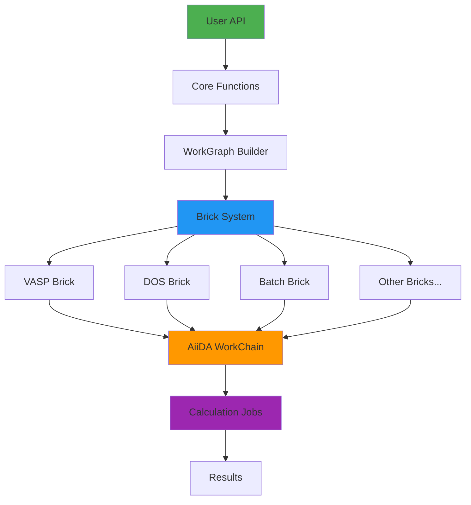

**Components:**

1. **Core API** (`quantum_lego.core`): High-level functions (`quick_vasp`, `quick_dos`, etc.)
2. **WorkGraph Builder** (`workgraph.py`): Builds AiiDA-WorkGraph workflows
3. **Brick System** (`bricks/`): Modular calculation components
4. **Port System** (`connections.py`): Type-safe connection validation
5. **AiiDA Backend**: Workflow engine and provenance tracking

---

## Tips & Best Practices

### 1. Start Simple
Begin with single calculations, then build to sequential workflows.

### 2. Validate Early
Connection validation happens before submission - check for errors immediately.

### 3. Test Locally First
Use `@localwork` with small structures before scaling to production.

### 4. Monitor Progress
Always use `verdi process show <PK>` to track calculation status.

### 5. Use Restart
Save WAVECAR from relaxations to speed up subsequent SCF/DOS calculations.

### 6. Set max_concurrent_jobs
Control parallelism based on cluster limits and job dependencies.

### 7. Retrieve Only What You Need
Extra files increase I/O time - only retrieve files you'll use.

### 8. Check Documentation
Each brick has specific requirements - see `AGENTS.md` for technical details.

---

## Troubleshooting

| Problem | Solution |
|---------|----------|
| `ModuleNotFoundError: quantum_lego` | `pip install -e /path/to/quantum-lego` |
| Code changes not working | `verdi daemon restart` (critical after code changes) |
| Process stuck in "Waiting" | Check `verdi process report <PK>` for details |
| VASP calculation failed | View output: `verdi calcjob outputcat <PK>` |
| Connection validation error | Check stage names match and output types are compatible |
| Tier3 tests skipped | Update `tests/fixtures/lego_reference_pks.json` with valid PKs |

---

## Getting Help

- **Examples**: See `examples/` directory for working code
- **Technical Details**: See `AGENTS.md` for development guide
- **API Reference**: See `README.md` for function signatures
- **GitHub Issues**: Report bugs at https://github.com/DoriniTT/quantum-lego/issues

---

**Happy building with Quantum Lego! 🧱⚗️**
