# Quantum Lego Documentation

**Build computational workflows like Lego blocks!**

Quantum Lego is a modular Python framework for building and composing computational chemistry workflows using AiiDA. It provides intuitive "brick" building blocks that can be connected together to create complex multi-stage calculations. For VASP workflows, the central execution path is `quick_vasp_sequential()`, with `quick_vasp`, `quick_vasp_batch`, and `quick_dos` acting as thin convenience wrappers.

## Table of Contents

- [Quick Start](#quick-start)
- [Core Concepts](#core-concepts)
- [Brick Types](#brick-types)
- [Sequential Workflows](#sequential-workflows)
- [Batch Operations](#batch-operations)
- [Examples](#examples)
- [Advanced Topics](#advanced-topics)

---

## Quick Start

### Installation

```bash
pip install -e /path/to/quantum-lego
```

### Your First Calculation

```python
from quantum_lego import quick_vasp, get_results, get_status
from aiida import orm, load_profile
from ase.io import read

# Load AiiDA profile
load_profile()

# Load structure
structure = orm.StructureData(ase=read('structure.vasp'))

# Run a simple VASP relaxation
pk = quick_vasp(
    structure=structure,
    code_label='VASP-6.5.1@localwork',
    incar={'NSW': 100, 'IBRION': 2, 'ENCUT': 400},
    kpoints_spacing=0.03,
    potential_family='PBE',
    potential_mapping={'Si': 'Si'},
    options={'resources': {'num_machines': 1, 'num_mpiprocs_per_machine': 8}},
    name='si_relax',
)

# Check status
status = get_status(pk)  # -> 'running', 'finished', 'failed'

# Get results when finished
results = get_results(pk)
print(f"Energy: {results['energy']:.4f} eV")
print(f"Formula: {results['structure'].get_formula()}")
```

---

## Core Concepts

### The Brick System

Quantum Lego uses a **brick-based architecture** where each "brick" represents a type of calculation or workflow step. Bricks can be connected together like Lego pieces to build complex multi-stage workflows.

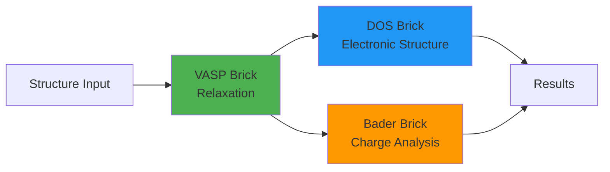

### Key Design Principles

1. **Incremental**: Run one step at a time, inspect results, decide what's next
2. **Modular**: Each brick has well-defined inputs and outputs
3. **Type-safe**: Port validation ensures correct connections between bricks
4. **Flexible**: No presets - you control all parameters explicitly

### Port System

Each brick has typed **input** and **output ports** that define what data flows in and out:

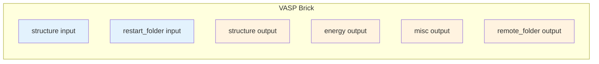

**Port Types:**
- `structure` - Atomic structures (StructureData)
- `energy` - Total energies (float)
- `misc` - Parsed calculation results (dict)
- `remote_folder` - Remote calculation directory (RemoteData)
- `retrieved` - Retrieved output files (FolderData)
- `dos_data` - Density of states data
- `trajectory` - AIMD trajectories
- `convergence` - Convergence test results
- `bader_charges` - Bader charge analysis results
- And more...

### Connection Validation

Quantum Lego validates all connections **before submission** to catch errors early:

```python
from quantum_lego import quick_vasp_sequential

stages = [
    {
        'name': 'relax',
        'type': 'vasp',
        'incar': {'NSW': 100, 'IBRION': 2},
    },
    {
        'name': 'dos',
        'type': 'dos',
        'structure_from': 'relax',  # ✓ Valid: connects to relaxed structure
        'scf_incar': {'ENCUT': 400},
        'dos_incar': {'NEDOS': 2000},
    },
]

result = quick_vasp_sequential(structure, stages=stages, ...)
# Validation happens automatically before submission!
```

---

## Brick Types

Quantum Lego provides a set of brick types for different calculation workflows. Each brick follows the same pattern:

```python
# Each brick exports:
PORTS                    # Input/output port declarations
validate_stage()         # Stage-specific validation
create_stage_tasks()     # Build WorkGraph tasks
expose_stage_outputs()   # Wire outputs
get_stage_results()      # Extract results
print_stage_results()    # Format output
```

### 1. VASP Brick (`vasp`)

Standard VASP calculation for relaxations, static SCF, and more.

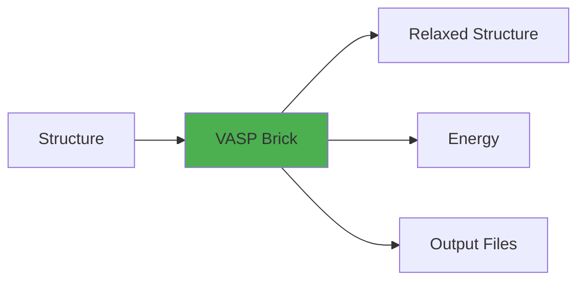

**Use cases:** Geometry optimization, static SCF, band structure calculations

**Example:**
```python
from quantum_lego import quick_vasp

pk = quick_vasp(
    structure=structure,
    code_label='VASP-6.5.1@localwork',
    incar={'NSW': 100, 'IBRION': 2, 'ENCUT': 520},
    kpoints_spacing=0.03,
    potential_family='PBE',
    potential_mapping={'Sn': 'Sn_d', 'O': 'O'},
    options={'resources': {'num_machines': 1, 'num_mpiprocs_per_machine': 8}},
    retrieve=['CHGCAR', 'WAVECAR'],  # Extra files beyond defaults
    name='sno2_relax',
)
```

**Key INCAR parameters:**
- `NSW`: Number of ionic steps (0=static, >0=relaxation)
- `IBRION`: Ionic relaxation method (2=conjugate gradient)
- `ISIF`: Stress/relaxation flag (2=ions only, 3=ions+cell)
- `ENCUT`: Plane-wave cutoff energy (eV)

### 2. DOS Brick (`dos`)

Density of states stage executed by the DOS brick (internally uses BandsWorkChain for automatic SCF + DOS).

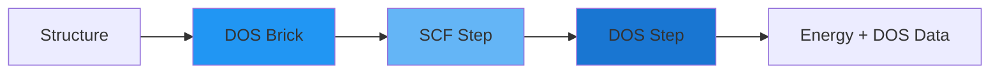

**Use cases:** Electronic structure analysis, band gap calculations, projected DOS

**Example:**
```python
from quantum_lego import quick_dos, get_stage_results

result = quick_dos(
    structure=structure,
    code_label='VASP-6.5.1@localwork',
    scf_incar={'encut': 400, 'ediff': 1e-6, 'ismear': 0},
    dos_incar={'nedos': 2000, 'lorbit': 11, 'ismear': -5},
    kpoints_spacing=0.03,
    dos_kpoints_spacing=0.02,  # Denser k-mesh for DOS
    potential_family='PBE',
    potential_mapping={'Sn': 'Sn_d', 'O': 'O'},
    options={'resources': {'num_machines': 1, 'num_mpiprocs_per_machine': 8}},
    retrieve=['DOSCAR', 'PROCAR'],
    name='sno2_dos',
)

# Get DOS stage results
dos_stage = get_stage_results(result, 'dos')
print(f"SCF Energy: {dos_stage['energy']:.4f} eV")
```

**Note:** AiiDA-VASP requires lowercase INCAR keys for the DOS brick.
For DOS-only stage pipelines, use `quick_dos_sequential(...)` (DOS-focused wrapper over `quick_vasp_sequential`).

**Outputs exposed on the WorkGraph:**
- SCF: `scf.misc`, `scf.remote`, `scf.retrieved`
- DOS: `dos.dos`, `dos.projectors`, `dos.misc`, `dos.remote`, `dos.retrieved`

In a sequential workflow, these appear under the stage namespace, e.g.
`s03_hse_dos.scf.retrieved` and `s03_hse_dos.dos.retrieved`.

**K-points:**
- `kpoints_spacing`: SCF mesh spacing (A^-1; aiida-vasp internally multiplies by `2π`)
- `dos_kpoints_spacing`: DOS mesh spacing (defaults to `0.8 * kpoints_spacing`)

### 2b. Hybrid Bands Brick (`hybrid_bands`)

Hybrid-functional band structure stage executed by the `hybrid_bands` brick
(internally uses `vasp.v2.hybrid_bands`, i.e. `VaspHybridBandsWorkChain`).

This workchain computes the band structure by appending the high-symmetry
band-path k-points as **zero-weighted k-points** to self-consistent
calculations (a standard approach for hybrid functionals such as HSE06).
The band path is automatically **split** into multiple child calculations
(`bandstructure_split_000`, `bandstructure_split_001`, …) to keep each job size
manageable.

**Key inputs:**
- `scf_incar` *(required)*: hybrid INCAR (e.g. `lhfcalc=True`, `hfscreen=0.2`)
- `band_settings` *(optional)*: subset of aiida-vasp `BandOptions` (e.g.
  `band_mode`, `band_kpoints_distance`, `symprec`, `kpoints_per_split`)
- `kpoints_spacing`: SCF mesh spacing (same unit as `vasp`/`dos` bricks)

**Splitting rule (practical):**
- the effective number of band-path k-points per split is roughly
  `kpoints_per_split - N_scf_ir`, where `N_scf_ir` is the number of irreducible
  SCF k-points generated from `kpoints_spacing`.

**Outputs exposed on the WorkGraph:**
- `bands.band_structure` (BandsData)
- `bands.primitive_structure` (StructureData)
- `bands.seekpath_parameters` (Dict)

**Important limitation (aiida-vasp 5.x):**
`VaspHybridBandsWorkChain` does **not** run a separate DOS step, even if
`band_settings.run_dos=True` or a `dos` namespace is provided.
For hybrid DOS, add a separate `dos` stage using hybrid INCAR + `ismear=-5`
(see example below).

**Important limitation (Quantum Lego wrapper):**
`hybrid_reuse_wavecar` must be `False`, since the Quantum Lego `hybrid_bands`
brick does not expose the internal `relax` namespace of the aiida-vasp workchain.

**Example (HSE06 bands + DOS in one sequential WorkGraph):**
```python
stages = [
    {
        'name': 'hse_bands',
        'type': 'hybrid_bands',
        'structure_from': 'input',
        'scf_incar': {'lhfcalc': True, 'hfscreen': 0.2, 'gga': 'PE', ...},
        'band_settings': {
            'band_mode': 'seekpath-aiida',
            'band_kpoints_distance': 0.05,
            'kpoints_per_split': 90,
            'hybrid_reuse_wavecar': False,
        },
        'kpoints_spacing': 0.05,
    },
    {
        'name': 'hse_dos',
        'type': 'dos',
        'structure': structure,  # explicit structure (hybrid_bands does not expose one)
        'scf_incar': {'lhfcalc': True, 'hfscreen': 0.2, 'gga': 'PE', ...},
        'dos_incar': {'ismear': -5, 'nedos': 2000, 'lhfcalc': True, ...},
        'kpoints_spacing': 0.05,
        'dos_kpoints_spacing': 0.04,
    },
]
```

Full runnable example:
- `examples/07_advanced_vasp/hybrid_bands_and_dos_sno2.py`

### 3. Batch Brick (`batch`)

Run multiple VASP calculations in parallel with per-structure parameter variations.

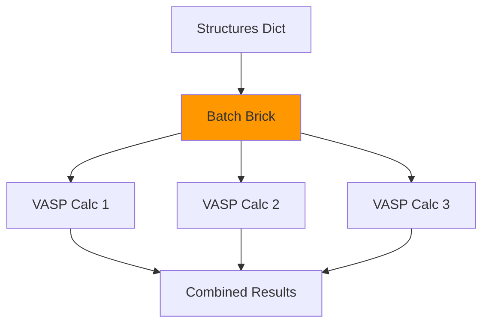

**Use cases:** Fukui analysis, defect calculations, parameter screening

**Example:**
```python
from quantum_lego import quick_vasp_batch, get_batch_results

# Multiple structures with individual INCAR overrides
structures = {
    'neutral': structure,
    'charged_plus': structure,
    'charged_minus': structure,
}

incar_overrides = {
    'charged_plus': {'NELECT': 191.95},   # +0.05e charge
    'charged_minus': {'NELECT': 192.05},  # -0.05e charge
}

result = quick_vasp_batch(
    structures=structures,
    code_label='VASP-6.5.1@localwork',
    incar={'NSW': 0, 'ENCUT': 400},  # Base INCAR
    incar_overrides=incar_overrides,
    kpoints_spacing=0.03,
    potential_family='PBE',
    potential_mapping={'Sn': 'Sn_d', 'O': 'O'},
    options={'resources': {'num_machines': 1, 'num_mpiprocs_per_machine': 8}},
    max_concurrent_jobs=4,
    name='fukui_batch',
)

# Extract results
batch_results = get_batch_results(result)
for key, res in batch_results.items():
    print(f"{key}: E = {res['energy']:.4f} eV")
```

### 4. AIMD Brick (`aimd`)

Ab initio molecular dynamics simulations with trajectory output.

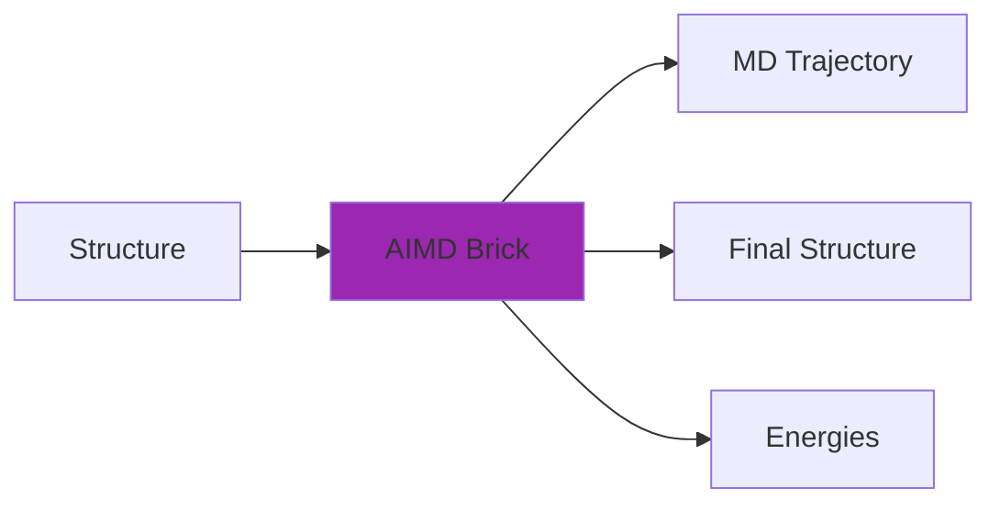

**Use cases:** Finite temperature dynamics, phase transitions, liquid simulations

**Example:**
```python
from quantum_lego import quick_aimd

pk = quick_aimd(
    structure=structure,
    code_label='VASP-6.5.1@localwork',
    incar={
        'IBRION': 0,     # MD
        'NSW': 1000,     # MD steps
        'TEBEG': 300,    # Initial temperature (K)
        'TEEND': 300,    # Final temperature (K)
        'SMASS': 0,      # NVE ensemble (or -1 for Andersen, -3 for Langevin)
        'POTIM': 1.0,    # Time step (fs)
        'ENCUT': 400,
    },
    kpoints_spacing=0.05,
    potential_family='PBE',
    potential_mapping={'Si': 'Si'},
    options={'resources': {'num_machines': 1, 'num_mpiprocs_per_machine': 8}},
    name='si_aimd',
)
```

### 5. Convergence Brick (`convergence`)

Test convergence with respect to ENCUT or k-points.

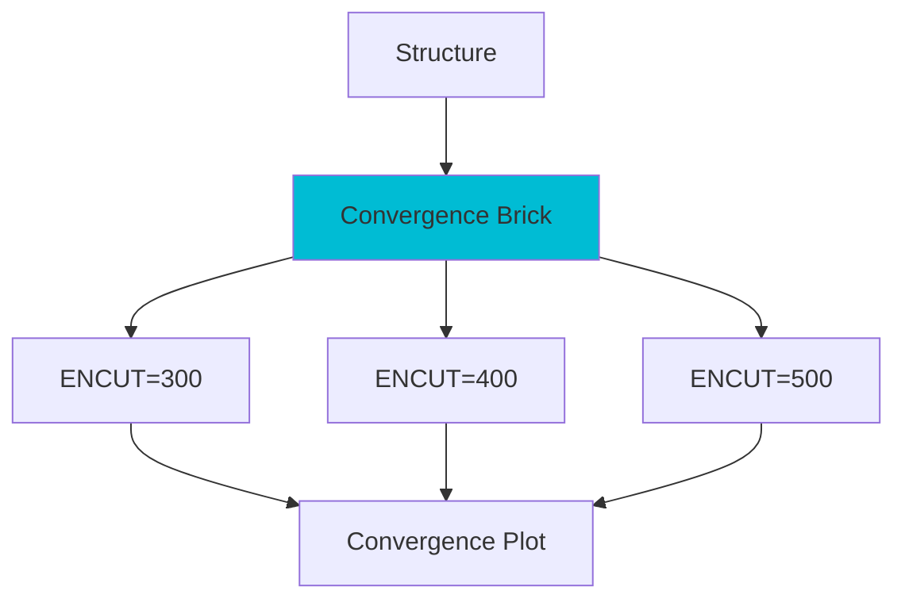

**Use cases:** Finding optimal calculation parameters, systematic parameter studies

**Example:**
```python
from quantum_lego import quick_vasp_sequential

stages = [
    {
        'name': 'conv',
        'type': 'convergence',
        'convergence_type': 'encut',  # or 'kpoints'
        'values': [300, 400, 500, 600],
        'incar': {'NSW': 0, 'PREC': 'Normal'},
        'kpoints_spacing': 0.03,
    },
]

result = quick_vasp_sequential(structure, stages=stages, ...)
```

### 6. Thickness Brick (`thickness`)

Slab thickness convergence testing for surface calculations.

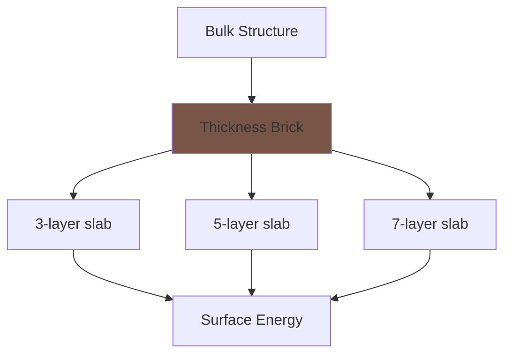

**Use cases:** Surface energy calculations, determining optimal slab thickness

### 7. Bader Brick (`bader`)

Bader charge analysis for electron density partitioning.

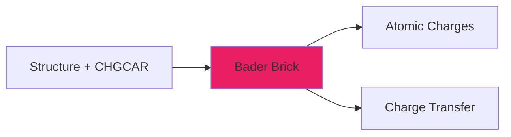

**Use cases:** Charge analysis, oxidation state determination, bonding analysis

### 8. Hubbard U Bricks (`hubbard_response`, `hubbard_analysis`)

Calculate Hubbard U parameters using the linear response method of Cococcioni & de Gironcoli.

**Validated:** NiO 2x2x2 AFM supercell (32 atoms) gives U(Ni-d) = 5.08 eV (VASP wiki reference: 5.58 eV), with R^2 > 0.999 for both chi and chi_0 fits.

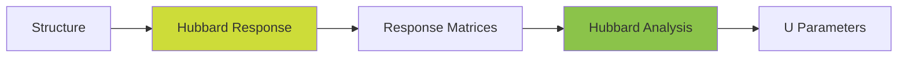

**Use cases:** DFT+U calculations for correlated systems (transition metal oxides, rare earths)

**Two approaches:**

1. **`quick_hubbard_u`** — convenience API that auto-builds the 3-stage pipeline:
```python
from quantum_lego import quick_hubbard_u

result = quick_hubbard_u(
    structure=structure,
    code_label='VASP-6.5.1-idefix-4@obelix',
    target_species='Ni',
    incar={'encut': 520, 'ediff': 1e-6, 'ismear': 0, 'sigma': 0.2,
           'prec': 'Accurate', 'lmaxmix': 4, 'ispin': 2,
           'magmom': [2.0] * 4 + [0.6] * 4},
    potential_values=[-0.2, -0.15, -0.1, -0.05, 0.05, 0.1, 0.15, 0.2],
    ldaul=2,
    kpoints_spacing=0.03,
    potential_family='PBE',
    potential_mapping={'Ni': 'Ni', 'O': 'O'},
    options=options,
)
```

2. **Explicit stages** — full control via `quick_vasp_sequential`:
```python
stages = [
    {
        'name': 'ground_state',
        'type': 'vasp',
        'incar': {**base_incar, 'nsw': 0, 'ibrion': -1,
                  'lorbit': 11, 'lwave': True, 'lcharg': True},
        'restart': None,
        'kpoints_spacing': 0.03,
    },
    {
        'name': 'response',
        'type': 'hubbard_response',
        'ground_state_from': 'ground_state',
        'structure_from': 'input',
        'target_species': 'Ni',
        'potential_values': [-0.20, -0.15, -0.10, -0.05, 0.05, 0.10, 0.15, 0.20],
        'ldaul': 2,
        'incar': base_incar,
        'kpoints_spacing': 0.03,
    },
    {
        'name': 'analysis',
        'type': 'hubbard_analysis',
        'response_from': 'response',
        'structure_from': 'input',
        'target_species': 'Ni',
        'ldaul': 2,
    },
]
```

**Key parameters:**
- `target_species`: Element symbol for the perturbed atom (e.g., `'Ni'`, `'Sn'`, `'Fe'`)
- `potential_values`: Perturbation potentials in eV (must not include 0.0; symmetric values recommended)
- `ldaul`: Angular momentum quantum number (`2` for d-electrons, `3` for f-electrons)
- `lmaxmix`: Set to `4` for d-electrons, `6` for f-electrons

**Output (`hubbard_u_result` Dict):**
- `U`: Hubbard U value in eV
- `chi_r2`, `chi_0_r2`: R-squared of the linear fits (should be > 0.99)
- `chi_slope`, `chi_0_slope`: Slopes of SCF and NSCF response
- `potential_values`, `delta_n_scf_values`, `delta_n_nscf_values`: Raw data points

**Reference:** [VASP wiki — Calculate U for LSDA+U](https://www.vasp.at/wiki/index.php/Calculate_U_for_LSDA+U)

### 9. NEB Bricks (`generate_neb_images`, `neb`)

Nudged Elastic Band calculations for reaction pathways.

```mermaid
graph LR
    A[Initial State] --> B[Generate Images]
    C[Final State] --> B
    B --> D[NEB stage1]
    D --> E[CI-NEB restart]
    E --> F[Barrier / TS Structure]

    style B fill:#607D8B
    style D fill:#455A64
    style E fill:#37474F
```

**Use cases:** Transition state search, reaction barrier calculations, diffusion pathways

**Image generation** uses a single `generate_neb_images_all` calcfunction that
interpolates *all* intermediate images at once (IDPP or linear) and stores them
as individual `StructureData` outputs (`image_01`, `image_02`, …).  This is more
efficient than per-image calcfunctions and plays well with WorkGraph serialisation.

**CI-NEB two-stage pattern** — run a regular NEB first, then restart with
`LCLIMB=True`.  Use the `restart` key to point to the first NEB stage; the brick
will copy the `WAVECAR`/image `CONTCAR` files automatically.

> **Note:** `LCLIMB` is stripped from the INCAR massager and injected via
> `prepend_text` (`echo LCLIMB=.TRUE. >> INCAR`), because `aiida-vasp` rejects
> unknown INCAR tags.  You do not need to work around this manually.

**Image source options** — exactly one of these must be set on a `neb` stage:

| Key | Description |
|---|---|
| `images_from` | Name of a preceding `generate_neb_images` stage |
| `images_dir` | Path to a directory containing `0N/POSCAR` files |

**Example (regular NEB → CI-NEB):**
```python
stages = [
    {'name': 'relax_initial', 'type': 'vasp', 'structure': initial, ...},
    {'name': 'relax_final',   'type': 'vasp', 'structure': final,   ...},
    {
        'name': 'make_images',
        'type': 'generate_neb_images',
        'initial_from': 'relax_initial',
        'final_from': 'relax_final',
        'n_images': 5,
        'method': 'idpp',   # or 'linear'
        'mic': True,
    },
    {
        'name': 'neb_stage1',
        'type': 'neb',
        'initial_from': 'relax_initial',
        'final_from': 'relax_final',
        'images_from': 'make_images',
        'incar': {'IBRION': 3, 'POTIM': 0, 'IOPT': 3, 'SPRING': -5, 'LCLIMB': False},
    },
    {
        'name': 'neb_cineb',
        'type': 'neb',
        'initial_from': 'relax_initial',
        'final_from': 'relax_final',
        'images_from': 'make_images',
        'restart': 'neb_stage1',   # copies WAVECAR + CONTCAR from stage 4
        'incar': {'IBRION': 3, 'POTIM': 0, 'IOPT': 3, 'SPRING': -5, 'LCLIMB': True},
    },
]
```

See `examples/06_surface/neb_pt_step_edge.py` for a complete working example
(N diffusion on a Pt(211) step edge, 5 images, VTST FIRE optimiser).

### 10. QE Brick (`qe`)

Quantum ESPRESSO pw.x calculations.

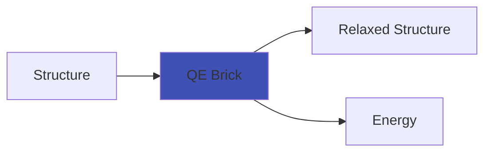

**Use cases:** Alternative DFT code, plane-wave calculations with ultrasoft pseudopotentials

### 11. CP2K Brick (`cp2k`)

CP2K calculations (mixed Gaussian/plane-wave basis).

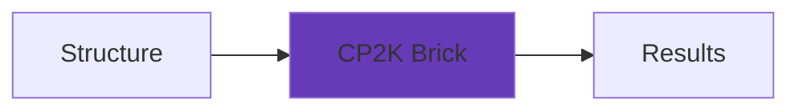

**Use cases:** Large-scale DFT, hybrid functionals, QM/MM simulations

### 12. Birch-Murnaghan Brick (`birch_murnaghan`)

Fits a third-order Birch-Murnaghan equation of state from batch VASP energies at different volumes.

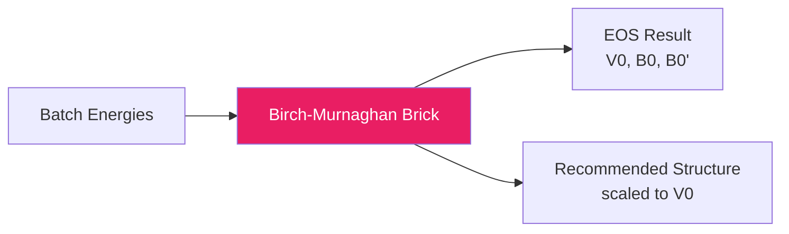

**Use cases:** Equilibrium volume determination, bulk modulus calculation, equation of state fitting

**Inputs:**
- `batch_from`: Name of a previous `batch` stage providing volume-energy data
- `volumes`: Dict mapping batch labels to volumes in A^3

**Outputs:**
- `eos_result`: Dict with V0, E0, B0 (GPa), B0', RMS residual, recommended label
- `recommended_structure`: StructureData scaled to the fitted equilibrium volume V0

**Example:**
```python
stages = [
    {
        'name': 'volume_scan',
        'type': 'batch',
        'structure_from': 'input',
        'base_incar': {'encut': 520, 'ediff': 1e-6, 'nsw': 0, 'ismear': 0},
        'kpoints_spacing': 0.03,
        'calculations': volume_calcs,  # {label: {'structure': StructureData}}
    },
    {
        'name': 'eos_fit',
        'type': 'birch_murnaghan',
        'batch_from': 'volume_scan',
        'volumes': volume_map,  # {label: volume_A3}
    },
]
```

### 13. Birch-Murnaghan Refine Brick (`birch_murnaghan_refine`)

Performs a zoomed-in BM scan around V0 from a previous BM fit. Generates volume-scaled structures, runs single-point VASP calculations, and fits a refined EOS.

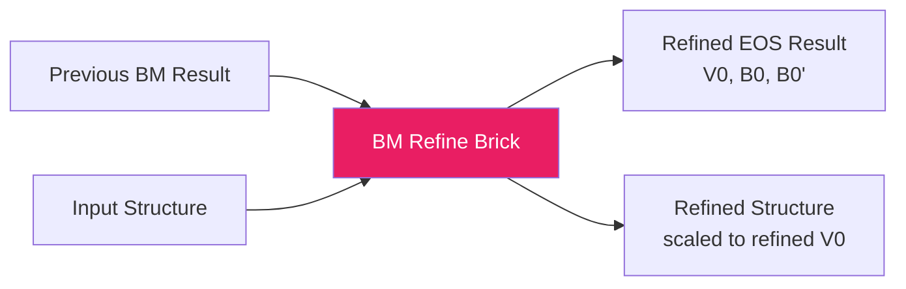

**Use cases:** High-precision equilibrium volume, improved bulk modulus after initial coarse scan

**Inputs:**
- `eos_from`: Name of a previous `birch_murnaghan` stage (provides V0 for centering)
- `structure_from`: Base structure for volume scaling (`'input'` or a previous stage)
- `base_incar`: INCAR parameters for the single-point VASP calculations
- `refine_strain_range`: Strain range around V0 (default: 0.02 = +/-2%)
- `refine_n_points`: Number of volume points (default: 7, minimum: 4)

**Outputs:**
- `eos_result`: Dict with refined V0, E0, B0, B0', RMS residual
- `recommended_structure`: StructureData scaled to refined V0

**Example:**
```python
stages = [
    # ... batch + birch_murnaghan stages above ...
    {
        'name': 'eos_refine',
        'type': 'birch_murnaghan_refine',
        'eos_from': 'eos_fit',
        'structure_from': 'input',
        'base_incar': {'encut': 520, 'ediff': 1e-6, 'nsw': 0, 'ismear': 0},
        'kpoints_spacing': 0.03,
        'refine_strain_range': 0.02,   # +/-2% around V0
        'refine_n_points': 7,
    },
]
```

### 14. Surface Enumeration Brick (`surface_enumeration`)

Determines all symmetrically non-equivalent low-index surface orientations for a bulk crystal. Pure-Python analysis brick (no VASP, no scheduler) — runs as an AiiDA calcfunction using pymatgen's symmetry utilities.

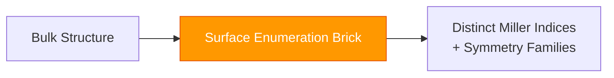

**Use cases:** Wulff construction planning, determining which surfaces to study, symmetry analysis

**Inputs:**
- `structure_from`: Source of the bulk structure (`'input'` or a previous stage)
- `max_index`: Maximum Miller index to consider (default: 1)
- `symprec`: Symmetry precision for SpacegroupAnalyzer (default: 0.01)

**Outputs:**
- `surface_families`: Dict with crystal system, space group, point group, distinct Miller indices, and symmetry-equivalent families for each

**Example:**
```python
stages = [
    {
        'name': 'relax',
        'type': 'vasp',
        'incar': {'encut': 520, 'nsw': 100, 'ibrion': 2, 'isif': 3},
        'restart': None,
    },
    {
        'name': 'enumerate_surfaces',
        'type': 'surface_enumeration',
        'structure_from': 'relax',  # or 'input' for initial structure
        'max_index': 1,
        'symprec': 0.01,
    },
]
```

**Output Dict structure:**
```python
{
    'crystal_system': 'tetragonal',
    'space_group_symbol': 'P4_2/mnm',
    'space_group_number': 136,
    'point_group': '4/mmm',
    'max_index': 1,
    'n_distinct_surfaces': 5,
    'distinct_miller_indices': [[1,0,0], [0,0,1], [1,0,1], [1,1,0], [1,1,1]],
    'families': {
        '(1, 0, 0)': [[1,0,0], [0,1,0], [-1,0,0], [0,-1,0]],
        ...
    },
}
```

---

### 15. Surface Terminations Brick (`surface_terminations`)

Generate **symmetrized slab terminations** for a given bulk structure and Miller index (pure-Python analysis brick).

**Use cases:** Build slab models before relaxation; enumerate all distinct terminations.

**Example:**
```python
stages = [
    {
        'name': 'slab_terms',
        'type': 'surface_terminations',
        'structure_from': 'bulk_relax',
        'miller_indices': [1, 1, 0],
        'min_slab_size': 18.0,
        'min_vacuum_size': 15.0,
        'lll_reduce': True,
        'center_slab': True,
        'primitive': True,
        'reorient_lattice': True,
    },
]
```

---

### 16. Dynamic Batch Brick (`dynamic_batch`)

Fan-out **many VASP relaxations in parallel** from a dynamically generated structure namespace (scatter-gather).

**Use cases:** Relax multiple slab terminations; relax defect variants; any stage where structures are only known at runtime.

**Example:**
```python
{
    'name': 'slab_relax',
    'type': 'dynamic_batch',
    'structures_from': 'slab_terms',
    'base_incar': slab_incar,
    'kpoints_spacing': 0.05,
}
```

---

### 17. Formation Enthalpy Brick (`formation_enthalpy`)

Compute ΔHf (per reduced formula unit) from a target bulk energy and elemental reference energies.

**Use cases:** Ab initio thermodynamics; stability limits for chemical potentials.

**Example:**
```python
{
    'name': 'dhf',
    'type': 'formation_enthalpy',
    'structure_from': 'bulk_relax',
    'energy_from': 'bulk_relax',
    'references': {'Sn': 'sn_relax', 'O': 'o2_ref'},
}
```

---

### 18. O2 Reference Energy Brick (`o2_reference_energy`)

Compute an **effective** O₂ reference energy via the water-splitting reaction (avoids the direct DFT O₂ error):

```
E_ref(O2) = 2 E_DFT(H2O) - 2 E_DFT(H2) + 5.52 eV
```

This brick runs VASP for **H₂** and **H₂O** (molecule-in-a-box, typically Γ-only), then exposes:
- `energy`: `E_ref(O2)` (Float, eV per O₂ molecule)
- `structure`: dummy 2-atom O₂ StructureData (to interoperate with `formation_enthalpy`)
- `misc`: Dict with the full breakdown

---

### 19. Surface Gibbs Energy Brick (`surface_gibbs_energy`)

Compute surface Gibbs free energies γ(Δμ) for each relaxed termination using
ab initio atomistic thermodynamics.

For a **binary oxide**, this produces γ(ΔμO) curves (J/m²) for each termination.

**Working example (binary oxide, SnO2(110)):**
`examples/06_surface/binary_surface_thermo/`

---

## Sequential Workflows

Build multi-stage workflows where each stage can use outputs from previous stages.

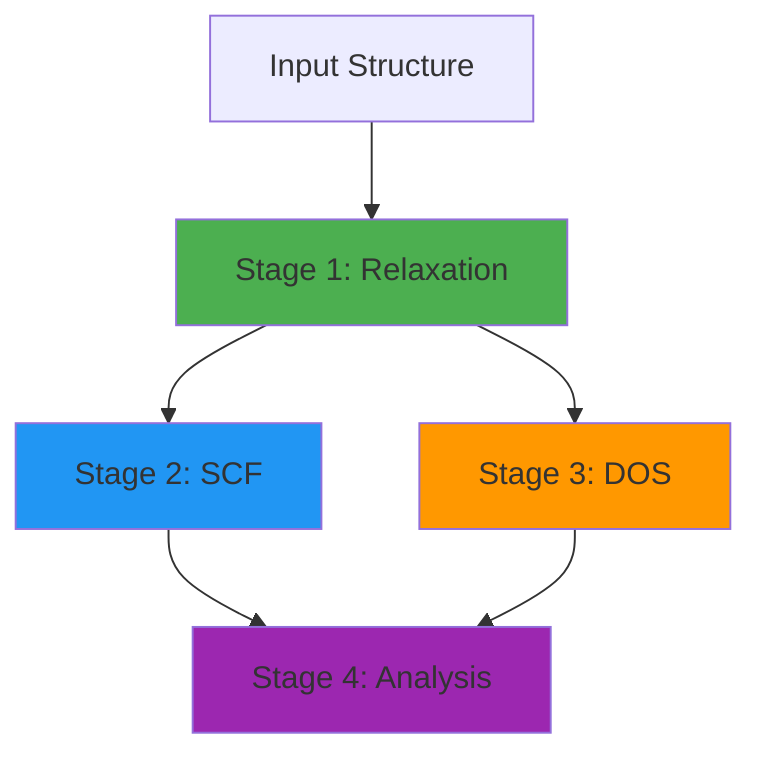

### Basic Sequential Pattern

```python
from quantum_lego import quick_vasp_sequential, print_sequential_results

stages = [
    # Stage 1: Relaxation
    {
        'name': 'relax',
        'type': 'vasp',
        'incar': {'NSW': 100, 'IBRION': 2, 'ISIF': 3, 'ENCUT': 520},
        'kpoints_spacing': 0.03,
        'restart': None,
    },
    # Stage 2: High-quality SCF on relaxed structure
    {
        'name': 'scf',
        'type': 'vasp',
        'structure_from': 'relax',  # Connect to relaxed structure
        'incar': {'NSW': 0, 'ENCUT': 600, 'EDIFF': 1e-7},
        'kpoints_spacing': 0.02,
        'restart': None,
    },
    # Stage 3: DOS on relaxed structure
    {
        'name': 'dos',
        'type': 'dos',
        'structure_from': 'relax',
        'scf_incar': {'encut': 600, 'ediff': 1e-6},
        'dos_incar': {'nedos': 3000, 'lorbit': 11, 'ismear': -5},
        'kpoints_spacing': 0.02,
        'dos_kpoints_spacing': 0.015,
    },
]

result = quick_vasp_sequential(
    structure=initial_structure,
    stages=stages,
    code_label='VASP-6.5.1@localwork',
    potential_family='PBE',
    potential_mapping={'Sn': 'Sn_d', 'O': 'O'},
    options={'resources': {'num_machines': 1, 'num_mpiprocs_per_machine': 8}},
    max_concurrent_jobs=2,  # Run stages in parallel when possible
    name='sno2_sequential',
)

# Monitor
pk = result['__workgraph_pk__']
print(f"WorkGraph PK: {pk}")
print("Monitor: verdi process show", pk)

# Get results when finished
print_sequential_results(result)
```

### Mixed Structure Sources in One WorkGraph

Use `structure_from` for dependency-linked stages and `structure` for independent stages.

```python
stages = [
    {
        'name': 'relax',
        'type': 'vasp',
        'incar': {'nsw': 100, 'ibrion': 2, 'isif': 2, 'encut': 520},
        'restart': None,
    },
    {
        'name': 'dos_relax',
        'type': 'dos',
        'structure_from': 'relax',  # from stage output
        'scf_incar': {'encut': 520, 'ediff': 1e-6},
        'dos_incar': {'nedos': 3000, 'lorbit': 11, 'ismear': -5},
    },
    {
        'name': 'dos_external',
        'type': 'dos',
        'structure': adsorbate_structure,  # explicit StructureData/PK
        'scf_incar': {'encut': 520, 'ediff': 1e-6},
        'dos_incar': {'nedos': 3000, 'lorbit': 11, 'ismear': -5},
    },
]

result = quick_vasp_sequential(
    structure=initial_structure,
    stages=stages,
    code_label='VASP-6.5.1@localwork',
    potential_family='PBE',
    potential_mapping={'Sn': 'Sn_d', 'O': 'O'},
    options={'resources': {'num_machines': 1, 'num_mpiprocs_per_machine': 8}},
    max_concurrent_jobs=2,  # global cap across all stage branches
)
```

Runnable example: `examples/vasp/run_mixed_dos_sources.py`

### Connection Types

**`structure_from`**: Get structure output from another stage
```python
{
    'name': 'dos',
    'type': 'dos',
    'structure_from': 'relax',  # Use relaxed structure
}
```

**`structure`**: Provide an explicit structure directly in the stage
```python
{
    'name': 'dos_external',
    'type': 'dos',
    'structure': adsorbate_structure,  # StructureData or PK
}
```

**`restart`**: Use remote folder (WAVECAR/CHGCAR) from another stage
```python
{
    'name': 'scf',
    'type': 'vasp',
    'structure_from': 'relax',
    'restart': 'relax',  # Continue from relaxation wavefunctions
}
```

**`charge_from`**: Use charge density from another stage
```python
{
    'name': 'bader',
    'type': 'bader',
    'structure_from': 'scf',
    'charge_from': 'scf',  # Use charge density from SCF
}
```

---

## Batch Operations

Run multiple calculations in parallel with systematic parameter variations.

### DOS Batch

```python
from quantum_lego import quick_dos_batch, get_batch_dos_results

structures = {
    'pristine': pristine_structure,
    'defect_1': defect_structure_1,
    'defect_2': defect_structure_2,
}

result = quick_dos_batch(
    structures=structures,
    code_label='VASP-6.5.1@localwork',
    scf_incar={'encut': 400, 'ediff': 1e-6},
    dos_incar={'nedos': 2000, 'lorbit': 11, 'ismear': -5},
    kpoints_spacing=0.03,
    dos_kpoints_spacing=0.02,
    potential_family='PBE',
    potential_mapping={'Sn': 'Sn_d', 'O': 'O'},
    options={'resources': {'num_machines': 1, 'num_mpiprocs_per_machine': 8}},
    max_concurrent_jobs=3,
    name='batch_dos',
)

# Get results
batch_results = get_batch_dos_results(result)
for key, res in batch_results.items():
    print(f"{key}: E = {res['energy']:.4f} eV")
```

### VASP Batch with INCAR Overrides

```python
from quantum_lego import quick_vasp_batch

# Fukui analysis example
N_neutral = 192
delta_values = [0.0, 0.05, 0.10, 0.15]

structures = {f'delta_{d:.2f}': structure for d in delta_values}

incar_overrides = {
    f'delta_{d:.2f}': {'NELECT': N_neutral - d}
    for d in delta_values if d > 0
}

result = quick_vasp_batch(
    structures=structures,
    code_label='VASP-6.5.1@localwork',
    incar={'NSW': 0, 'ENCUT': 400, 'ALGO': 'All'},
    incar_overrides=incar_overrides,
    kpoints_spacing=0.03,
    potential_family='PBE',
    potential_mapping={'Sn': 'Sn_d', 'O': 'O'},
    options={'resources': {'num_machines': 1, 'num_mpiprocs_per_machine': 8}},
    max_concurrent_jobs=2,
    retrieve=['CHGCAR'],
    name='fukui_plus',
)
```

---

## Examples

### Example 1: Simple Relaxation

```python
from quantum_lego import quick_vasp, get_results
from aiida import orm, load_profile
from ase.io import read

load_profile()

structure = orm.StructureData(ase=read('si.vasp'))

pk = quick_vasp(
    structure=structure,
    code_label='VASP-6.5.1@localwork',
    incar={'NSW': 100, 'IBRION': 2, 'ENCUT': 400},
    kpoints_spacing=0.03,
    potential_family='PBE',
    potential_mapping={'Si': 'Si'},
    options={'resources': {'num_machines': 1, 'num_mpiprocs_per_machine': 8}},
    name='si_relax',
)

print(f"Submitted: PK {pk}")
print(f"Monitor: verdi process show {pk}")
```

### Example 2: Relax + DOS

```python
from quantum_lego import quick_vasp_sequential, print_sequential_results

stages = [
    {
        'name': 'relax',
        'type': 'vasp',
        'incar': {'NSW': 100, 'IBRION': 2, 'ENCUT': 520},
    },
    {
        'name': 'dos',
        'type': 'dos',
        'structure_from': 'relax',
        'scf_incar': {'encut': 520, 'ediff': 1e-6},
        'dos_incar': {'nedos': 2000, 'lorbit': 11, 'ismear': -5},
    },
]

result = quick_vasp_sequential(
    structure=structure,
    stages=stages,
    code_label='VASP-6.5.1@localwork',
    potential_family='PBE',
    potential_mapping={'Sn': 'Sn_d', 'O': 'O'},
    options={'resources': {'num_machines': 1, 'num_mpiprocs_per_machine': 8}},
    name='relax_dos',
)

print_sequential_results(result)
```

### Example 3: Convergence Testing

```python
stages = [
    {
        'name': 'convergence',
        'type': 'convergence',
        'convergence_type': 'encut',
        'values': [300, 350, 400, 450, 500, 550, 600],
        'incar': {'NSW': 0, 'PREC': 'Accurate'},
        'kpoints_spacing': 0.03,
    },
]

result = quick_vasp_sequential(
    structure=structure,
    stages=stages,
    code_label='VASP-6.5.1@localwork',
    potential_family='PBE',
    potential_mapping={'Si': 'Si'},
    options={'resources': {'num_machines': 1, 'num_mpiprocs_per_machine': 8}},
    max_concurrent_jobs=4,
    name='encut_convergence',
)
```

### Example 4: NEB Calculation (N diffusion on Pt step edge)

Full two-stage NEB (regular NEB → CI-NEB) for N diffusion on a Pt(211) step
edge.  Requires VASP with the VTST patch.

```python
from pathlib import Path
from ase.io import read
from aiida import orm
from quantum_lego import quick_vasp_sequential

initial_structure = orm.StructureData(ase=read('n_pt_step_initial.vasp'))
final_structure   = orm.StructureData(ase=read('n_pt_step_final.vasp'))

COMMON_INCAR = {'encut': 400, 'ediff': 1e-5, 'prec': 'Normal', 'lwave': True, 'lcharg': False}
NEB_INCAR    = {**COMMON_INCAR, 'ibrion': 3, 'potim': 0, 'iopt': 3, 'spring': -5,
                'ediffg': -0.1, 'nsw': 500, 'ismear': 1, 'sigma': 0.1, 'algo': 'Fast'}

stages = [
    # Relax endpoints
    {'name': 'relax_initial', 'type': 'vasp',
     'incar': {**COMMON_INCAR, 'ibrion': 2, 'isif': 2, 'nsw': 200, 'ediffg': -0.05}},
    {'name': 'relax_final',   'type': 'vasp', 'structure': final_structure,
     'incar': {**COMMON_INCAR, 'ibrion': 2, 'isif': 2, 'nsw': 200, 'ediffg': -0.05}},

    # Interpolate 5 images with IDPP
    {
        'name': 'make_images',
        'type': 'generate_neb_images',
        'initial_from': 'relax_initial',
        'final_from': 'relax_final',
        'n_images': 5,
        'method': 'idpp',
        'mic': True,
    },

    # Regular NEB (no climbing image)
    {
        'name': 'neb_stage1',
        'type': 'neb',
        'initial_from': 'relax_initial',
        'final_from': 'relax_final',
        'images_from': 'make_images',
        'incar': {**NEB_INCAR, 'LCLIMB': False},
        'options': {'resources': {'num_machines': 3, 'num_cores_per_machine': 40}},
    },

    # CI-NEB restart from stage 4
    {
        'name': 'neb_cineb',
        'type': 'neb',
        'initial_from': 'relax_initial',
        'final_from': 'relax_final',
        'images_from': 'make_images',
        'restart': 'neb_stage1',
        'incar': {**NEB_INCAR, 'LCLIMB': True, 'ediffg': -0.05},
        'options': {'resources': {'num_machines': 3, 'num_cores_per_machine': 40}},
    },
]

result = quick_vasp_sequential(
    structure=initial_structure,
    stages=stages,
    code_label='VASP-VTST-6.4.3@bohr',
    kpoints_spacing=0.06,
    potential_family='PBE',
    potential_mapping={'Pt': 'Pt', 'N': 'N'},
    options={'resources': {'num_machines': 1, 'num_cores_per_machine': 40}},
    max_concurrent_jobs=4,
    name='n_pt_step_neb',
)
```

See `examples/06_surface/neb_pt_step_edge.py` for the full runnable script
including structure generation.

---

## Advanced Topics

### File Retrieval

Standard VASP files are always retrieved:
- `INCAR`, `KPOINTS`, `POTCAR`, `POSCAR`
- `CONTCAR`, `OUTCAR`, `vasprun.xml`, `OSZICAR`

To retrieve additional files:

```python
pk = quick_vasp(
    structure=structure,
    # ... other parameters ...
    retrieve=['CHGCAR', 'WAVECAR', 'LOCPOT', 'DOSCAR'],
)
```

### Restart Workflows

Use WAVECAR/CHGCAR from previous calculations:

```python
# Run 1: Generate WAVECAR
pk1 = quick_vasp(
    structure=structure,
    incar={'NSW': 100, 'IBRION': 2, 'LWAVE': True},
    name='relax',
)

# Run 2: Continue from WAVECAR
pk2 = quick_vasp(
    restart_from=pk1,  # Auto-loads structure + WAVECAR
    incar={'NSW': 0, 'NEDOS': 2000},
    copy_wavecar=True,
    name='dos',
)
```

### Max Concurrent Jobs

Control parallelism for cluster limitations:

```python
result = quick_vasp_batch(
    structures=structures,
    # ... other parameters ...
    max_concurrent_jobs=4,  # Run max 4 jobs in parallel
)
```

For `localwork` (development), use `max_concurrent_jobs=1` since it runs jobs serially.

### Result Extraction

```python
from quantum_lego import (
    get_results,
    get_energy,
    get_stage_results,
    get_dos_results,
    get_batch_results,
    export_files,
)

# Single calculation
results = get_results(pk)
energy = get_energy(pk)  # Shortcut

# DOS stage from quick_dos / quick_vasp_sequential result
dos_stage = get_stage_results(dos_result, 'dos')

# Advanced: raw BandsWorkChain PK
dos_results = get_dos_results(bands_pk)

# Batch results
batch_results = get_batch_results(result)

# Export files
exported = export_files(pk, output_dir='./results/', files=['CHGCAR', 'DOSCAR'])
```

### Monitoring

```bash
# Show process status
verdi process show <PK>

# Show detailed report
verdi process report <PK>

# List recent calculations
verdi process list -a -p 1

# View daemon logs
verdi daemon logshow
```

### Custom Structures

```python
from ase.io import read
from ase.build import bulk, surface
from aiida import orm

# From file
structure = orm.StructureData(ase=read('structure.vasp'))

# From ASE builders
atoms = bulk('Si', 'diamond', a=5.43)
structure = orm.StructureData(ase=atoms)

# Surface slab
atoms = surface('Al', (1, 1, 1), 4, vacuum=10.0)
structure = orm.StructureData(ase=atoms)
```

### Error Handling

```python
from quantum_lego import get_status, get_results

status = get_status(pk)

if status == 'failed':
    print(f"Calculation failed! Check: verdi process show {pk}")
elif status == 'finished':
    results = get_results(pk)
    print(f"Energy: {results['energy']:.4f} eV")
elif status in ['waiting', 'running']:
    print(f"Calculation {status}...")
```

### Cluster Configuration Examples

**Development (localwork):**
```python
code_label = 'VASP-6.5.1@localwork'
options = {
    'resources': {'num_machines': 1, 'num_mpiprocs_per_machine': 8},
}
max_concurrent_jobs = 1  # Serial execution
```

**Production (HPC cluster):**
```python
code_label = 'VASP-6.5.1-idefix-4@obelix'
options = {
    'resources': {'num_machines': 1, 'num_mpiprocs_per_machine': 4},
    'custom_scheduler_commands': '''#PBS -l cput=90000:00:00
#PBS -l nodes=1:ppn=88:skylake
#PBS -j oe
#PBS -N MyJobName''',
}
```

---

## Architecture Overview

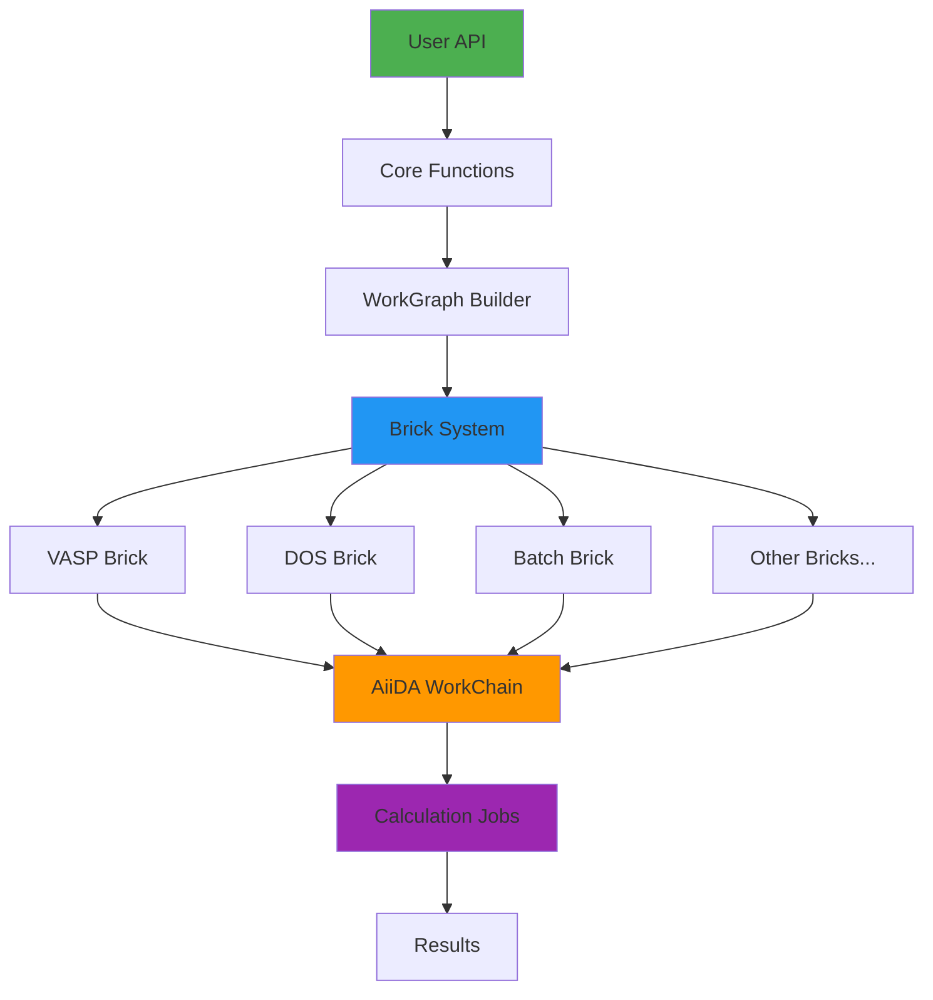

**Components:**

1. **Core API** (`quantum_lego.core`): High-level functions (`quick_vasp`, `quick_dos`, etc.)
2. **WorkGraph Builder** (`workgraph.py`): Builds AiiDA-WorkGraph workflows
3. **Brick System** (`bricks/`): Modular calculation components
4. **Port System** (`connections.py`): Type-safe connection validation
5. **AiiDA Backend**: Workflow engine and provenance tracking

---

## Tips & Best Practices

### 1. Start Simple
Begin with single calculations, then build to sequential workflows.

### 2. Validate Early
Connection validation happens before submission - check for errors immediately.

### 3. Test Locally First
Use `@localwork` with small structures before scaling to production.

### 4. Monitor Progress
Always use `verdi process show <PK>` to track calculation status.

### 5. Use Restart
Save WAVECAR from relaxations to speed up subsequent SCF/DOS calculations.

### 6. Set max_concurrent_jobs
Control parallelism based on cluster limits and job dependencies.

### 7. Retrieve Only What You Need
Extra files increase I/O time - only retrieve files you'll use.

### 8. Check Documentation
Each brick has specific requirements - see `AGENTS.md` for technical details.

---

## Troubleshooting

| Problem | Solution |
|---------|----------|
| `ModuleNotFoundError: quantum_lego` | `pip install -e /path/to/quantum-lego` |
| Code changes not working | `verdi daemon restart` (critical after code changes) |
| Process stuck in "Waiting" | Check `verdi process report <PK>` for details |
| VASP calculation failed | View output: `verdi calcjob outputcat <PK>` |
| Connection validation error | Check stage names match and output types are compatible |
| Tier3 tests skipped | Update `tests/fixtures/lego_reference_pks.json` with valid PKs |

---

## Getting Help

- **Examples**: See `examples/` directory for working code
- **Technical Details**: See `AGENTS.md` for development guide
- **API Reference**: See `../README.md` for function signatures
- **GitHub Issues**: Report bugs at https://github.com/DoriniTT/quantum-lego/issues

---

**Happy building with Quantum Lego! 🧱⚗️**
