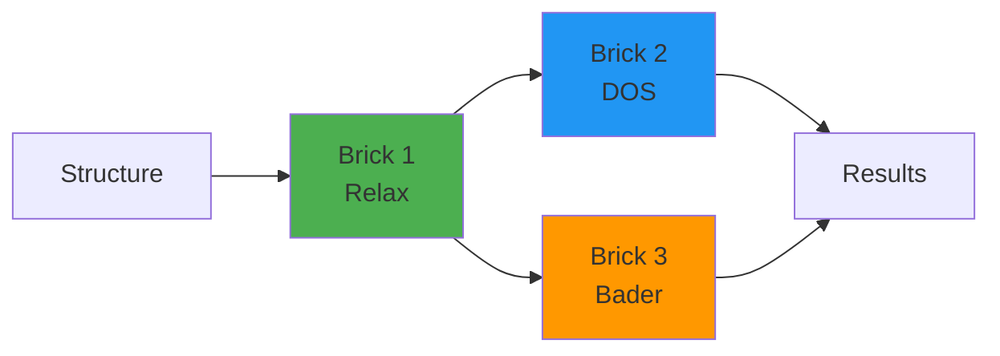

# Quantum Lego Quick Start Guide

**Get started with Quantum Lego in 5 minutes!**

## What is Quantum Lego?

Quantum Lego lets you build computational chemistry workflows like Lego blocks. Each "brick" is a calculation type (VASP, DOS, batch, etc.) that can connect to other bricks to create complex multi-stage workflows.

## Installation

```bash
pip install -e /path/to/quantum-lego
```

## Your First Calculation

### 1. Import and Setup

```python
from quantum_lego import quick_vasp, get_status, get_results
from aiida import orm, load_profile
from ase.io import read

# Load your AiiDA profile
load_profile('presto')  # or your profile name
```

### 2. Load a Structure

```python
# From a VASP file
structure = orm.StructureData(ase=read('structure.vasp'))

# Or create with ASE
from ase.build import bulk
atoms = bulk('Si', 'diamond', a=5.43)
structure = orm.StructureData(ase=atoms)
```

### 3. Run a Calculation

```python
pk = quick_vasp(
    structure=structure,
    code_label='VASP-6.5.1@localwork',  # Your VASP code
    incar={
        'NSW': 100,      # 100 ionic steps
        'IBRION': 2,     # Conjugate gradient
        'ENCUT': 400,    # 400 eV cutoff
    },
    kpoints_spacing=0.03,  # K-points density (Å⁻¹)
    potential_family='PBE',
    potential_mapping={'Si': 'Si'},  # Element → POTCAR mapping
    options={
        'resources': {
            'num_machines': 1,
            'num_mpiprocs_per_machine': 8,
        },
    },
    name='si_relax',
)

print(f"Submitted! PK: {pk}")
```

### 4. Monitor Progress

```bash
# In terminal:
verdi process show <PK>
```

Or in Python:
```python
status = get_status(pk)
print(status)  # 'waiting', 'running', 'finished', 'failed'
```

### 5. Get Results

```python
# Wait until status is 'finished'
results = get_results(pk)

print(f"Energy: {results['energy']:.4f} eV")
print(f"Formula: {results['structure'].get_formula()}")
print(f"Files: {results['files'].list_object_names()}")
```

## Common Calculation Types

### VASP Relaxation

```python
pk = quick_vasp(
    structure=structure,
    code_label='VASP-6.5.1@localwork',
    incar={'NSW': 100, 'IBRION': 2, 'ISIF': 3, 'ENCUT': 400},
    kpoints_spacing=0.03,
    potential_family='PBE',
    potential_mapping={'Sn': 'Sn_d', 'O': 'O'},
    options={'resources': {'num_machines': 1, 'num_mpiprocs_per_machine': 8}},
    name='relax',
)
```

### DOS Calculation

```python
from quantum_lego import quick_dos, get_dos_results

pk = quick_dos(
    structure=structure,
    code_label='VASP-6.5.1@localwork',
    scf_incar={
        'encut': 400,
        'ediff': 1e-6,
        'ismear': 0,
        'sigma': 0.05,
    },
    dos_incar={
        'nedos': 2000,
        'lorbit': 11,
        'ismear': -5,  # Tetrahedron method
    },
    kpoints_spacing=0.03,
    dos_kpoints_spacing=0.02,  # Denser for DOS
    potential_family='PBE',
    potential_mapping={'Sn': 'Sn_d', 'O': 'O'},
    options={'resources': {'num_machines': 1, 'num_mpiprocs_per_machine': 8}},
    name='dos',
)

results = get_dos_results(pk)
print(f"Energy: {results['energy']:.4f} eV")
```

Note: DOS brick uses lowercase INCAR keys (requirement from AiiDA-VASP).

### Batch Calculations

Run multiple structures in parallel:

```python
from quantum_lego import quick_vasp_batch, get_batch_results

structures = {
    'pristine': structure1,
    'defect_1': structure2,
    'defect_2': structure3,
}

result = quick_vasp_batch(
    structures=structures,
    code_label='VASP-6.5.1@localwork',
    incar={'NSW': 0, 'ENCUT': 400},
    kpoints_spacing=0.03,
    potential_family='PBE',
    potential_mapping={'Sn': 'Sn_d', 'O': 'O'},
    options={'resources': {'num_machines': 1, 'num_mpiprocs_per_machine': 8}},
    max_concurrent_jobs=2,
    name='batch_calc',
)

# Get results
batch_results = get_batch_results(result)
for key, res in batch_results.items():
    print(f"{key}: E = {res['energy']:.4f} eV")
```

### Sequential Workflow

Chain multiple calculations together:

```python
from quantum_lego import quick_vasp_sequential, print_sequential_results

stages = [
    # Stage 1: Relax
    {
        'name': 'relax',
        'type': 'vasp',
        'incar': {'NSW': 100, 'IBRION': 2, 'ENCUT': 520},
    },
    # Stage 2: DOS on relaxed structure
    {
        'name': 'dos',
        'type': 'dos',
        'structure_from': 'relax',  # Connect to previous stage
        'scf_incar': {'encut': 520, 'ediff': 1e-6},
        'dos_incar': {'nedos': 2000, 'lorbit': 11, 'ismear': -5},
    },
    {
        'name': 'dos_external',
        'type': 'dos',
        'structure': alt_structure,  # Explicit StructureData/PK
        'scf_incar': {'encut': 520, 'ediff': 1e-6},
        'dos_incar': {'nedos': 2000, 'lorbit': 11, 'ismear': -5},
    },
]

result = quick_vasp_sequential(
    structure=structure,
    stages=stages,
    code_label='VASP-6.5.1@localwork',
    potential_family='PBE',
    potential_mapping={'Sn': 'Sn_d', 'O': 'O'},
    options={'resources': {'num_machines': 1, 'num_mpiprocs_per_machine': 8}},
    name='relax_then_dos',
)

print_sequential_results(result)
```

For DOS stages, provide exactly one structure source:
- `structure_from='some_stage'`, or
- `structure=<StructureData|PK>`

Runnable example: `examples/vasp/run_mixed_dos_sources.py`

## Understanding the Brick System



Each brick:
- Has **inputs** (structure, parameters)
- Has **outputs** (structure, energy, files)
- Can **connect** to other bricks via typed ports
- Is **validated** before submission

Available brick types:
- `vasp` - Standard VASP calculations
- `dos` - Density of states
- `batch` - Parallel calculations
- `aimd` - Molecular dynamics
- `convergence` - Parameter convergence tests
- `bader` - Charge analysis
- `neb` - Reaction pathways
- `qe` - Quantum ESPRESSO
- `cp2k` - CP2K
- And more...

## Key Concepts

### 1. Ports (Connections)

Bricks connect via typed ports:

```python
# VASP outputs 'structure' and 'energy'
# DOS needs 'structure' as input
{
    'name': 'dos',
    'type': 'dos',
    'structure_from': 'relax',  # ✓ Valid connection (or use 'structure')
}
```

### 2. Stage Definition

Each stage needs:
- `name`: Unique identifier
- `type`: Brick type (`vasp`, `dos`, etc.)
- Configuration (INCAR, k-points, etc.)
- Connections to previous stages (optional)

### 3. Result Extraction

```python
# Single calculation
results = get_results(pk)
energy = results['energy']
structure = results['structure']

# Batch calculation
batch_results = get_batch_results(result)

# Sequential workflow
print_sequential_results(result)
```

## File Retrieval

Standard files are always retrieved:
- `INCAR`, `KPOINTS`, `POTCAR`, `POSCAR`
- `CONTCAR`, `OUTCAR`, `vasprun.xml`, `OSZICAR`

Add extra files:
```python
pk = quick_vasp(
    # ... other parameters ...
    retrieve=['CHGCAR', 'WAVECAR', 'DOSCAR'],
)
```

## Restart from Previous Calculation

```python
# Run 1: Relaxation with WAVECAR output
pk1 = quick_vasp(
    structure=structure,
    incar={'NSW': 100, 'IBRION': 2, 'LWAVE': True},
    name='relax',
)

# Run 2: Continue from WAVECAR
pk2 = quick_vasp(
    restart_from=pk1,  # Auto-uses structure + WAVECAR
    incar={'NSW': 0, 'NEDOS': 2000},
    name='dos',
)
```

Or in sequential workflows:
```python
stages = [
    {'name': 'relax', 'type': 'vasp', 'incar': {...}},
    {
        'name': 'scf',
        'type': 'vasp',
        'structure_from': 'relax',
        'restart': 'relax',  # Use WAVECAR from relax
        'incar': {...},
    },
]
```

## Monitoring Commands

```bash
# Show process status
verdi process show <PK>

# Detailed report with hierarchy
verdi process report <PK>

# List all recent processes
verdi process list -a -p 1

# View daemon logs
verdi daemon logshow

# Restart daemon (after code changes)
verdi daemon restart
```

## Common Pitfalls

### 1. Daemon Not Running
```bash
verdi daemon status
verdi daemon start
```

### 2. Code Not Found
```bash
verdi code list
# Use exact label from the list
```

### 3. Wrong INCAR Case
DOS brick requires lowercase keys:
```python
# ✗ Wrong
dos_incar={'NEDOS': 2000, 'LORBIT': 11}

# ✓ Correct
dos_incar={'nedos': 2000, 'lorbit': 11}
```

### 4. Missing Potential Mapping
```python
# ✗ Wrong
potential_mapping={'Sn': 'Sn'}

# ✓ Correct (use Sn_d for d-electrons)
potential_mapping={'Sn': 'Sn_d', 'O': 'O'}
```

### 5. Max Concurrent Jobs
For local testing:
```python
max_concurrent_jobs=1  # localwork runs serially
```

## Next Steps

1. **Try the examples** in `examples/` directory
2. **Read full documentation** in `DOCUMENTATION.md`
3. **Check technical details** in `AGENTS.md`
4. **Explore brick types** - each has specific capabilities

## Helpful Functions

```python
from quantum_lego import (
    # Submission
    quick_vasp,
    quick_dos,
    quick_vasp_batch,
    quick_dos_batch,
    quick_vasp_sequential,
    quick_aimd,
    quick_qe,

    # Results
    get_results,
    get_energy,
    get_dos_results,
    get_batch_results,
    get_batch_dos_results,
    get_stage_results,

    # Display
    print_sequential_results,
    print_dos_results,
    print_batch_dos_results,

    # Utilities
    get_status,
    export_files,
    list_calculations,
    get_restart_info,
)
```

## Example: Complete Workflow

```python
from quantum_lego import quick_vasp_sequential, print_sequential_results
from aiida import orm, load_profile
from ase.build import bulk

# Setup
load_profile('presto')
structure = orm.StructureData(ase=bulk('Si', 'diamond', a=5.43))

# Define workflow
stages = [
    {
        'name': 'relax',
        'type': 'vasp',
        'incar': {'NSW': 100, 'IBRION': 2, 'ISIF': 3, 'ENCUT': 400},
    },
    {
        'name': 'scf',
        'type': 'vasp',
        'structure_from': 'relax',
        'incar': {'NSW': 0, 'ENCUT': 500, 'EDIFF': 1e-7},
        'restart': 'relax',
    },
    {
        'name': 'dos',
        'type': 'dos',
        'structure_from': 'relax',  # or 'structure': another_structure
        'scf_incar': {'encut': 500, 'ediff': 1e-6},
        'dos_incar': {'nedos': 2000, 'lorbit': 11, 'ismear': -5},
    },
]

# Submit
result = quick_vasp_sequential(
    structure=structure,
    stages=stages,
    code_label='VASP-6.5.1@localwork',
    potential_family='PBE',
    potential_mapping={'Si': 'Si'},
    options={'resources': {'num_machines': 1, 'num_mpiprocs_per_machine': 8}},
    kpoints_spacing=0.03,
    name='si_complete_workflow',
)

# Monitor
pk = result['__workgraph_pk__']
print(f"Submitted WorkGraph: {pk}")
print("Monitor: verdi process show", pk)

# Get results when finished
print_sequential_results(result)
```

---

**Ready to build? Check out `DOCUMENTATION.md` for comprehensive examples and advanced topics!**
