# Quantum Lego Visual Workflow Guide

This guide provides visual diagrams for common computational workflows using Quantum Lego bricks. For VASP workflows, `quick_vasp_sequential()` is the central execution path behind stage/brick orchestration.

## Table of Contents

- [Basic Single Calculations](#basic-single-calculations)
- [Sequential Workflows](#sequential-workflows)
- [Batch Operations](#batch-operations)
- [Advanced Multi-Stage Workflows](#advanced-multi-stage-workflows)
- [NEB Calculations](#neb-calculations)
- [Port Connection Patterns](#port-connection-patterns)

---

## Basic Single Calculations

### Simple VASP Relaxation

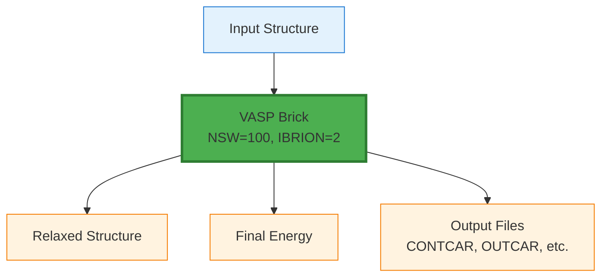

**Code:**
```python
pk = quick_vasp(
    structure=structure,
    code_label='VASP-6.5.1@localwork',
    incar={'NSW': 100, 'IBRION': 2, 'ENCUT': 400},
    kpoints_spacing=0.03,
    ...
)
```

### DOS Calculation (Two-Step Process)

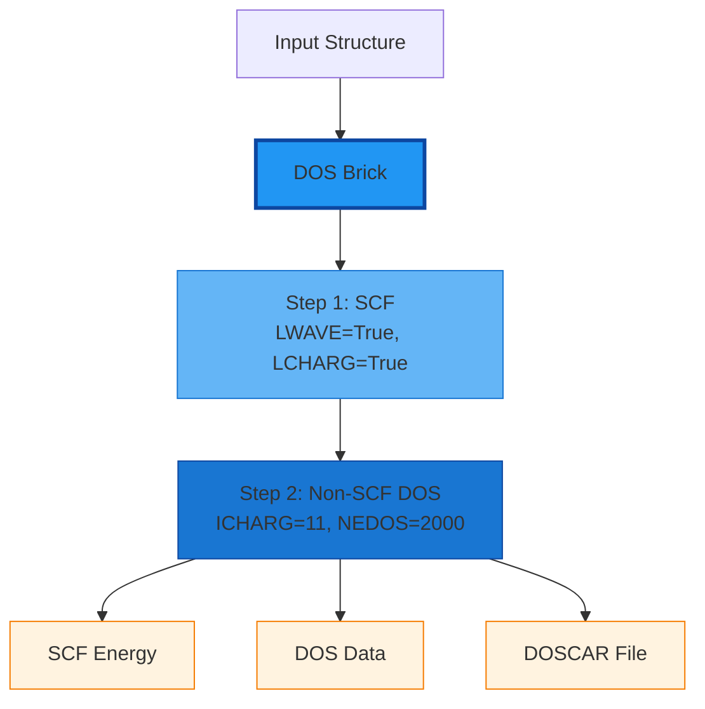

**Code:**
```python
result = quick_dos(
    structure=structure,
    code_label='VASP-6.5.1@localwork',
    scf_incar={'encut': 400, 'ediff': 1e-6},
    dos_incar={'nedos': 2000, 'lorbit': 11, 'ismear': -5},
    kpoints_spacing=0.03,
    dos_kpoints_spacing=0.02,
    ...
)
dos_stage = get_stage_results(result, 'dos')
```

---

## Sequential Workflows

### Relaxation → SCF → DOS

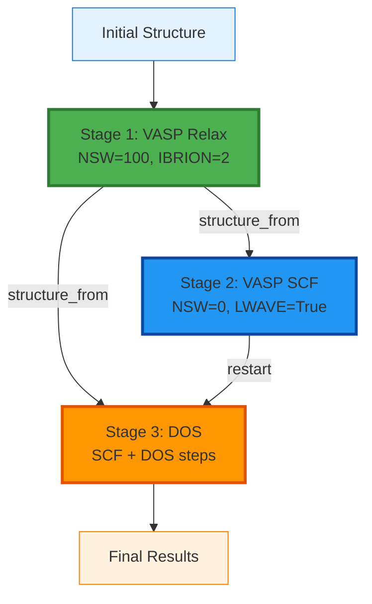

**Code:**
```python
stages = [
    {
        'name': 'relax',
        'type': 'vasp',
        'incar': {'NSW': 100, 'IBRION': 2, 'ENCUT': 520},
    },
    {
        'name': 'scf',
        'type': 'vasp',
        'structure_from': 'relax',
        'incar': {'NSW': 0, 'ENCUT': 600, 'LWAVE': True},
        'restart': None,
    },
    {
        'name': 'dos',
        'type': 'dos',
        'structure_from': 'relax',
        'scf_incar': {'encut': 600, 'ediff': 1e-6},
        'dos_incar': {'nedos': 2000, 'lorbit': 11},
    },
]

result = quick_vasp_sequential(structure, stages=stages, ...)
```

### Relaxation → Bader Analysis

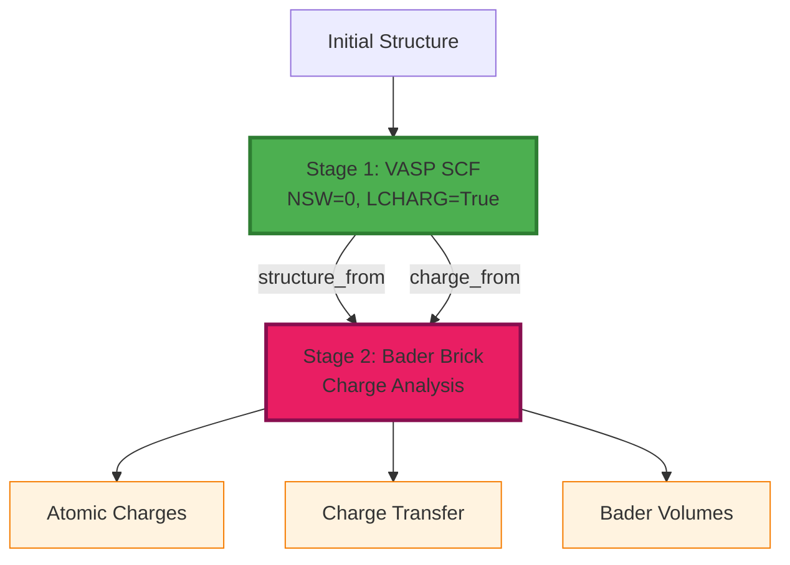

**Code:**
```python
stages = [
    {
        'name': 'scf',
        'type': 'vasp',
        'incar': {'NSW': 0, 'ENCUT': 500, 'LCHARG': True},
    },
    {
        'name': 'bader',
        'type': 'bader',
        'structure_from': 'scf',
        'charge_from': 'scf',
    },
]
```

### Convergence Testing

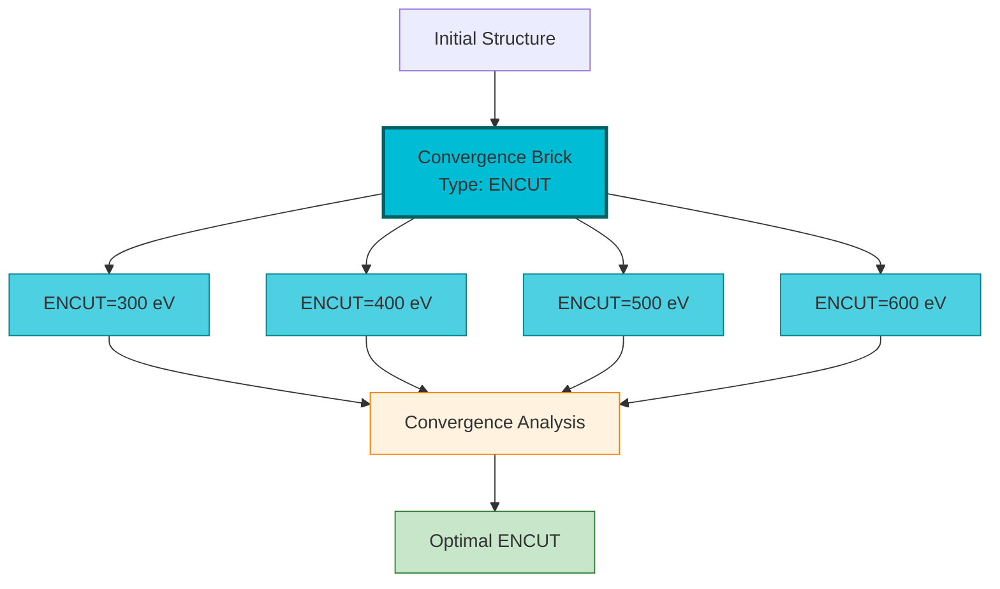

**Code:**
```python
stages = [
    {
        'name': 'convergence',
        'type': 'convergence',
        'convergence_type': 'encut',
        'values': [300, 400, 500, 600],
        'incar': {'NSW': 0, 'PREC': 'Accurate'},
    },
]
```

---

## Batch Operations

### Batch VASP Calculations

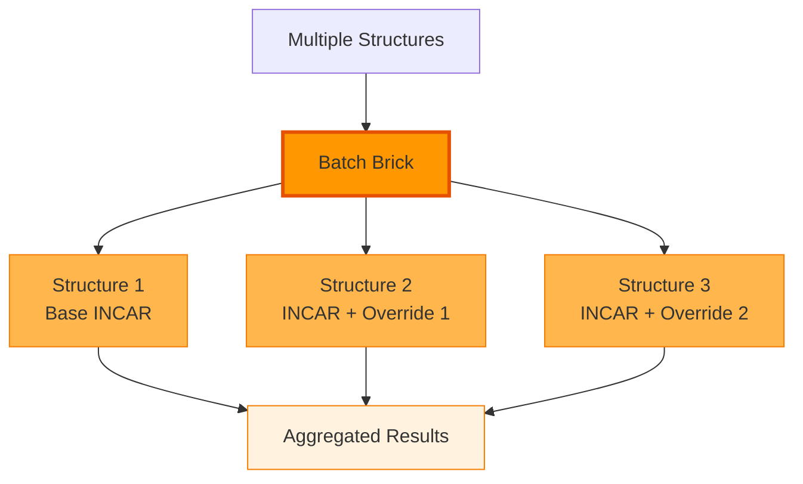

**Code:**
```python
structures = {
    'pristine': structure1,
    'defect_1': structure2,
    'defect_2': structure3,
}

incar_overrides = {
    'defect_1': {'NELECT': 191.95},
    'defect_2': {'NELECT': 192.05},
}

result = quick_vasp_batch(
    structures=structures,
    incar={'NSW': 0, 'ENCUT': 400},
    incar_overrides=incar_overrides,
    ...
)
```

### Batch DOS Calculations

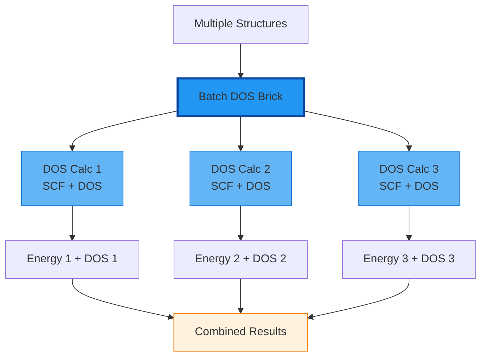

**Code:**
```python
structures = {
    'struct_1': structure1,
    'struct_2': structure2,
    'struct_3': structure3,
}

result = quick_dos_batch(
    structures=structures,
    scf_incar={'encut': 400, 'ediff': 1e-6},
    dos_incar={'nedos': 2000, 'lorbit': 11, 'ismear': -5},
    max_concurrent_jobs=2,
    ...
)
```

---

## Advanced Multi-Stage Workflows

### Relax → Multiple Analyses

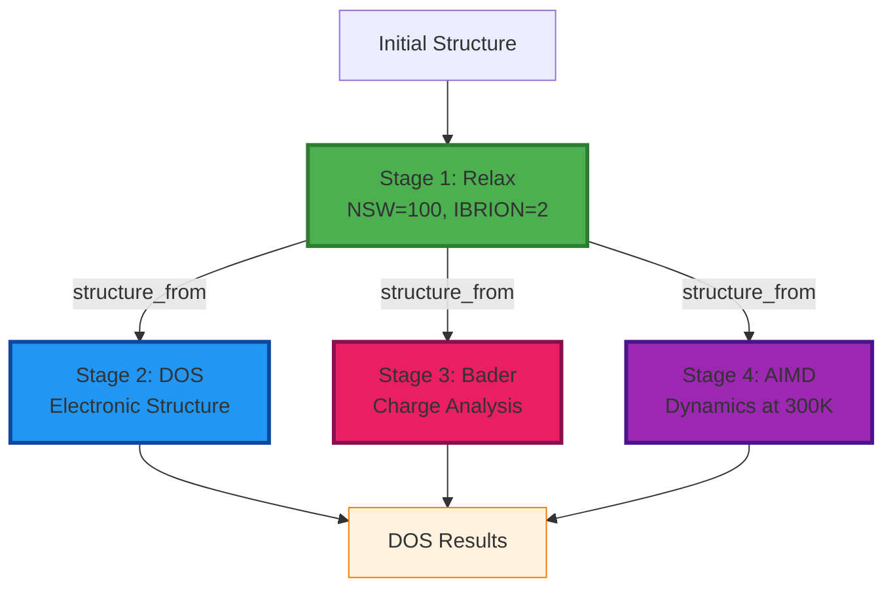

**Note:** Stages C, D, and E can run in parallel if `max_concurrent_jobs > 1`.

### Hubbard U Calculation

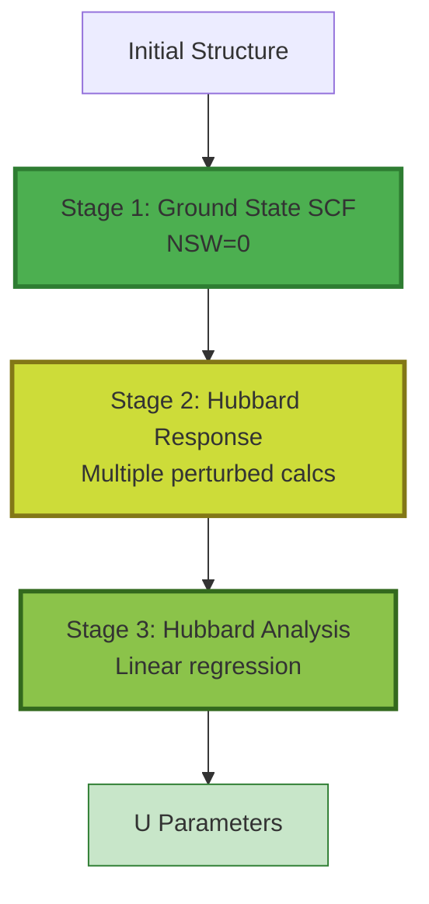

**Code:**
```python
stages = [
    {
        'name': 'ground_state',
        'type': 'vasp',
        'incar': {'NSW': 0, 'ENCUT': 500},
    },
    {
        'name': 'response',
        'type': 'hubbard_response',
        'ground_state_from': 'ground_state',
        'perturbed_incar': {'ENCUT': 500},
        'atom_index': 0,
        'perturbations': [-0.2, -0.1, 0.1, 0.2],
    },
    {
        'name': 'analysis',
        'type': 'hubbard_analysis',
        'response_from': 'response',
    },
]
```

---

## NEB Calculations

### Complete NEB Workflow

```mermaid
graph TD
    A1[Initial Structure] --> B1[Stage 1: Relax Initial<br/>NSW=100, IBRION=2]
    A2[Final Structure] --> B2[Stage 2: Relax Final<br/>NSW=100, IBRION=2]
    B1 --> C[Stage 3: Generate Images<br/>n_images=7]
    B2 --> C
    C --> D[Stage 4: NEB Calculation<br/>IBRION=3, IOPT=3]
    D --> E[Stage 5: CI-NEB<br/>LCLIMB=True]
    E --> F[Reaction Path]
    E --> G[Energy Barrier]
    E --> H[Transition State]

    style B1 fill:#4CAF50,stroke:#2E7D32,stroke-width:3px
    style B2 fill:#4CAF50,stroke:#2E7D32,stroke-width:3px
    style C fill:#607D8B,stroke:#263238,stroke-width:3px
    style D fill:#455A64,stroke:#263238,stroke-width:3px
    style E fill:#37474F,stroke:#263238,stroke-width:3px
    style F fill:#FFF3E0,stroke:#F57C00
    style G fill:#FFF3E0,stroke:#F57C00
    style H fill:#FFF3E0,stroke:#F57C00
```

**Code:**
```python
stages = [
    {
        'name': 'relax_initial',
        'type': 'vasp',
        'structure': initial_structure,
        'incar': {'NSW': 100, 'IBRION': 2, 'ENCUT': 400},
    },
    {
        'name': 'relax_final',
        'type': 'vasp',
        'structure': final_structure,
        'incar': {'NSW': 100, 'IBRION': 2, 'ENCUT': 400},
    },
    {
        'name': 'make_images',
        'type': 'generate_neb_images',
        'initial_from': 'relax_initial',
        'final_from': 'relax_final',
        'n_images': 7,
    },
    {
        'name': 'neb',
        'type': 'neb',
        'initial_from': 'relax_initial',
        'final_from': 'relax_final',
        'images_from': 'make_images',
        'incar': {'IBRION': 3, 'IOPT': 3, 'NSW': 200, 'SPRING': -5},
    },
    {
        'name': 'neb_ci',
        'type': 'neb',
        'initial_from': 'relax_initial',
        'final_from': 'relax_final',
        'images_from': 'make_images',
        'restart': 'neb',
        'incar': {'IBRION': 3, 'IOPT': 3, 'NSW': 200, 'SPRING': -5, 'LCLIMB': True},
    },
]

result = quick_vasp_sequential(structure=initial_structure, stages=stages, ...)
```

---

## Port Connection Patterns

### Port Types and Connections

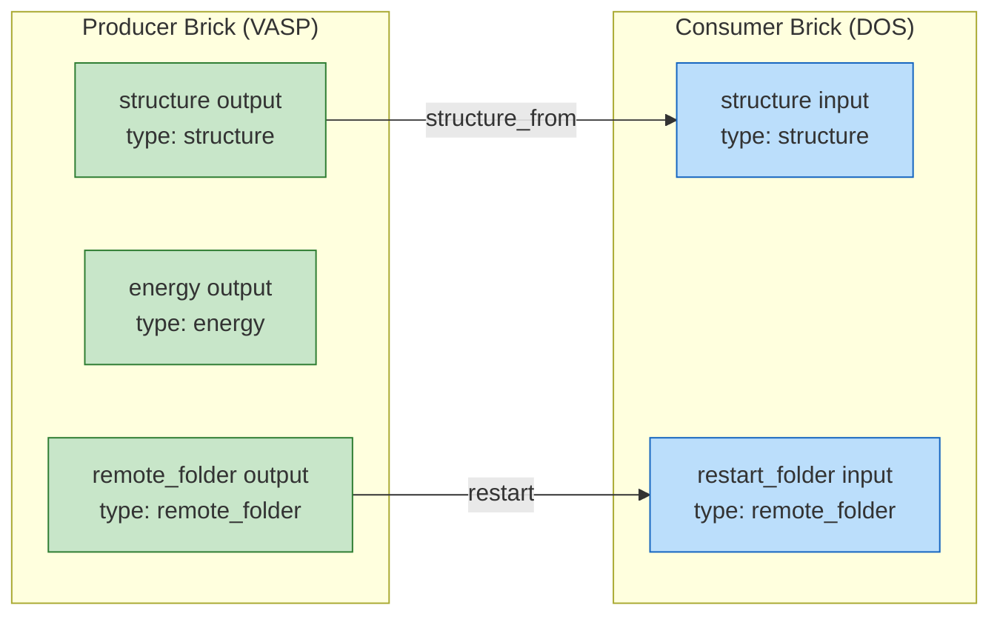

### Valid Connection Examples

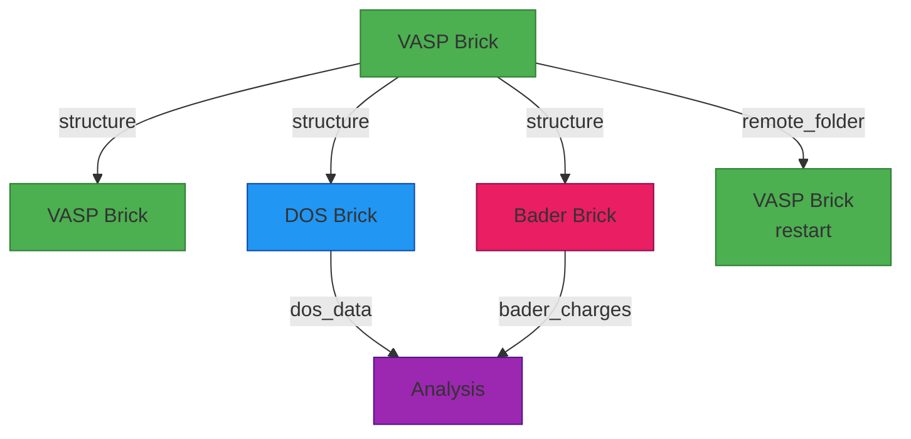

### Invalid Connection (Caught by Validation)

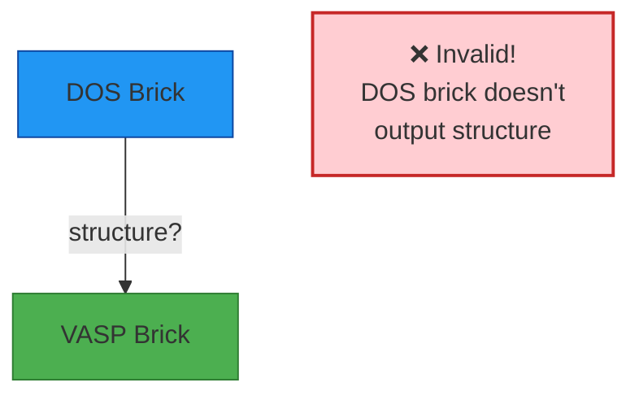

**Note:** DOS bricks perform calculations but don't modify the structure, so they don't have a `structure` output port.

---

## Workflow Execution Patterns

### Serial Execution (max_concurrent_jobs=1)

```mermaid
gantt
    title Serial Execution Timeline
    dateFormat X
    axisFormat %s

    section Stages
    Relax       :0, 100s
    SCF         :100s, 50s
    DOS         :150s, 80s
```

**Code:**
```python
result = quick_vasp_sequential(
    structure=structure,
    stages=stages,
    max_concurrent_jobs=1,  # One at a time
    ...
)
```

### Parallel Execution (max_concurrent_jobs=3)

```mermaid
gantt
    title Parallel Execution Timeline
    dateFormat X
    axisFormat %s

    section Independent
    Relax       :0, 100s

    section Parallel (after relax)
    DOS         :100s, 80s
    Bader       :100s, 60s
    AIMD        :100s, 120s
```

**Code:**
```python
stages = [
    {'name': 'relax', 'type': 'vasp', ...},
    {'name': 'dos', 'type': 'dos', 'structure_from': 'relax', ...},
    {'name': 'bader', 'type': 'bader', 'structure_from': 'relax', ...},
    {'name': 'aimd', 'type': 'aimd', 'structure_from': 'relax', ...},
]

result = quick_vasp_sequential(
    structure=structure,
    stages=stages,
    max_concurrent_jobs=3,  # DOS, Bader, AIMD run in parallel
    ...
)
```

---

## Complete Example: Surface Adsorption Study

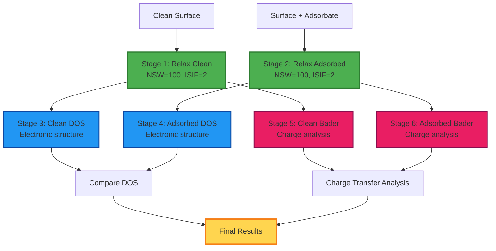

**Implementation:**
```python
# Two separate sequential workflows
stages_clean = [
    {'name': 'relax', 'type': 'vasp', 'incar': {...}},
    {'name': 'dos', 'type': 'dos', 'structure_from': 'relax', ...},
    {'name': 'bader', 'type': 'bader', 'structure_from': 'relax', ...},
]

stages_adsorbed = [
    {'name': 'relax', 'type': 'vasp', 'incar': {...}},
    {'name': 'dos', 'type': 'dos', 'structure_from': 'relax', ...},
    {'name': 'bader', 'type': 'bader', 'structure_from': 'relax', ...},
]

result_clean = quick_vasp_sequential(clean_surface, stages=stages_clean, ...)
result_adsorbed = quick_vasp_sequential(surface_with_adsorbate, stages=stages_adsorbed, ...)

# Compare results
clean_energy = get_stage_results(result_clean, 'relax')['energy']
adsorbed_energy = get_stage_results(result_adsorbed, 'relax')['energy']
adsorption_energy = adsorbed_energy - clean_energy
```

---

## Summary

### Brick Color Code

- 🟢 **Green (VASP)**: Standard DFT calculations
- 🔵 **Blue (DOS)**: Electronic structure analysis
- 🟠 **Orange (Batch)**: Parallel operations
- 🟣 **Purple (AIMD)**: Molecular dynamics
- 🔴 **Pink (Bader)**: Charge analysis
- 🟡 **Yellow/Green (Hubbard)**: DFT+U calculations
- ⚫ **Gray (NEB)**: Reaction pathways
- 🔵 **Indigo (QE/CP2K)**: Alternative DFT codes
- 🔷 **Cyan (Convergence)**: Parameter optimization

### Key Principles

1. **Validate Before Submit**: Connections are checked automatically
2. **Type Safety**: Port types must match (structure→structure, energy→energy)
3. **Parallel When Possible**: Independent stages run concurrently
4. **Restart Saves Time**: Use WAVECAR/CHGCAR from previous stages
5. **Monitor Progress**: Always use `verdi process show <PK>`

---

**For more details, see `DOCUMENTATION.md` and `QUICK_START.md`!**
