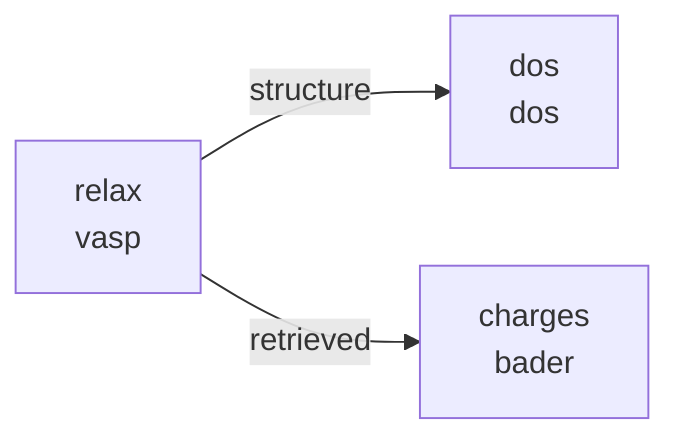

# Plan: Explicit Brick Connections for the Lego Module

*Created: 2026-02-01*
*Status: BRAINSTORMING / DRAFT*

---

## Problem Statement

Currently, brick connections (which outputs from one brick feed into which inputs of another) are **implicit**. The logic lives scattered across `validate_stage()`, `create_stage_tasks()`, and `resolve_structure_from()`. A user writing a run script must read source code or documentation to understand:

1. What each brick **provides** (its outputs/sockets)
2. What each brick **requires** (its inputs from other stages)
3. Which brick types are **compatible** with each other's connections

For example:
- `bader` requires `charge_from` → a `vasp` stage (hard-coded check in `bader.py:68`)
- `dos` requires `structure_from` → any stage that has a structure, but it doesn't produce a new structure itself
- `vasp` is a "joker" — it produces structure, energy, remote_folder, retrieved, etc. and can connect to almost anything

This makes it hard to:
- Add new bricks without studying all existing ones
- Validate user-defined pipelines early (before submission)
- Auto-suggest valid connections in tooling or error messages

---

## Design Goals

1. **Explicit port declarations** — Each brick declares what it provides and what it needs
2. **Compile-time validation** — When the user defines stages, validate all connections before submitting to AiiDA
3. **Self-documenting** — A user can inspect a brick to see its ports without reading source code
4. **Backward compatible** — Existing run scripts continue to work
5. **Minimal boilerplate** — Adding a new brick should stay lightweight

---

## Proposed Architecture

### 1. Port Declarations per Brick

Each brick module gains a `PORTS` dict (or a function `get_ports()`) that declares inputs and outputs:

```python
# bricks/vasp.py

PORTS = {
    'inputs': {
        'structure': {
            'type': 'structure',        # Port type (for matching)
            'required': True,
            'source': 'auto',           # 'auto' = previous stage or structure_from
            'description': 'Input structure (from previous stage, structure_from, or initial)',
        },
        'restart_folder': {
            'type': 'remote_folder',
            'required': False,
            'source': 'restart',        # Resolved via 'restart' field in stage config
            'description': 'Remote folder for WAVECAR/CHGCAR restart',
        },
    },
    'outputs': {
        'structure': {
            'type': 'structure',
            'description': 'Relaxed structure (only if NSW > 0)',
            'conditional': 'nsw > 0',   # Only available when relaxation is on
        },
        'energy': {
            'type': 'energy',
            'description': 'Total energy (eV)',
        },
        'misc': {
            'type': 'misc',
            'description': 'Parsed VASP results dict',
        },
        'remote_folder': {
            'type': 'remote_folder',
            'description': 'Remote calculation directory',
        },
        'retrieved': {
            'type': 'retrieved',
            'description': 'Retrieved files (CONTCAR, OUTCAR, etc.)',
        },
    },
}
```

```python
# bricks/dos.py

PORTS = {
    'inputs': {
        'structure': {
            'type': 'structure',
            'required': True,
            'source': 'structure_from',
            'description': 'Structure to compute DOS for',
        },
    },
    'outputs': {
        'energy': {
            'type': 'energy',
            'description': 'SCF energy',
        },
        'scf_misc': {
            'type': 'misc',
            'description': 'SCF parsed results',
        },
        'dos_misc': {
            'type': 'misc',
            'description': 'DOS parsed results',
        },
        'dos': {
            'type': 'dos_data',
            'description': 'DOS ArrayData',
        },
        'projectors': {
            'type': 'projectors',
            'description': 'Projected DOS data',
        },
        # NOTE: no 'structure' output — DOS doesn't modify structure
    },
}
```

```python
# bricks/bader.py

PORTS = {
    'inputs': {
        'charge_files': {
            'type': 'retrieved',
            'required': True,
            'source': 'charge_from',
            'compatible_bricks': ['vasp'],  # Only VASP produces AECCAR files
            'prerequisites': {
                'incar': {'laechg': True, 'lcharg': True},
                'retrieve': ['AECCAR0', 'AECCAR2', 'CHGCAR', 'OUTCAR'],
            },
            'description': 'Retrieved folder with AECCAR0, AECCAR2, CHGCAR',
        },
        'structure': {
            'type': 'structure',
            'required': True,
            'source': 'charge_from',    # Gets structure from same stage
            'description': 'Structure for Bader assignment',
        },
    },
    'outputs': {
        'charges': {
            'type': 'bader_charges',
            'description': 'Bader charges per atom (Dict)',
        },
    },
}
```

### 2. Port Type System

Port types define what kind of data flows through a connection. The key insight is that **connection compatibility is determined by port type matching**, not brick type checking.

```python
# Proposed port type hierarchy:

PORT_TYPES = {
    'structure':     'StructureData — atomic positions + cell',
    'energy':        'Float — total energy in eV',
    'misc':          'Dict — parsed calculation results',
    'remote_folder': 'RemoteData — link to files on cluster',
    'retrieved':     'FolderData — files retrieved from cluster',
    'dos_data':      'ArrayData — density of states',
    'projectors':    'ArrayData — projected DOS data',
    'bader_charges': 'Dict — Bader charges per atom',
    'trajectory':    'TrajectoryData — MD trajectory',
    'convergence':   'Dict — convergence test results',
}
```

Two ports can be connected if they have the **same type** (or, in the future, compatible types). Additionally, some ports may have `compatible_bricks` constraints for cases where the type alone isn't sufficient (e.g., bader needs AECCAR files which only VASP produces).

### 3. Connection Resolution

The `source` field in input ports tells the system how to resolve the connection:

| Source Value | Resolution Logic |
|---|---|
| `'auto'` | Previous stage (default chain), `structure_from`, or initial input |
| `'structure_from'` | Look up `stage['structure_from']` to find the source stage |
| `'charge_from'` | Look up `stage['charge_from']` to find the source stage |
| `'restart'` | Look up `stage['restart']` to find the restart stage |
| `'explicit'` | User must provide the data directly in the stage config |

This is essentially formalizing what already happens today, but making it inspectable.

### 4. Validation at Stage Definition Time

When the user calls `quick_vasp_sequential(stages=...)`, the system should:

```python
def validate_connections(stages):
    """Validate all inter-stage connections before submission."""
    available_outputs = {}  # stage_name -> {port_name: port_type}

    for stage in stages:
        brick = get_brick_module(stage.get('type', 'vasp'))
        ports = brick.PORTS

        # Check that every required input can be satisfied
        for input_name, input_port in ports['inputs'].items():
            if not input_port['required']:
                continue

            source_key = input_port['source']
            if source_key == 'auto':
                # Auto-resolved from previous stage or structure_from
                continue  # handled by existing logic

            # Get the stage name this input references
            ref_stage_name = stage.get(source_key)
            if ref_stage_name is None:
                raise ValueError(
                    f"Stage '{stage['name']}': input '{input_name}' requires "
                    f"'{source_key}' field but it's missing"
                )

            if ref_stage_name not in available_outputs:
                raise ValueError(
                    f"Stage '{stage['name']}': '{source_key}={ref_stage_name}' "
                    f"references unknown stage"
                )

            # Check type compatibility
            ref_outputs = available_outputs[ref_stage_name]
            matching = [
                name for name, otype in ref_outputs.items()
                if otype == input_port['type']
            ]
            if not matching:
                raise ValueError(
                    f"Stage '{stage['name']}': input '{input_name}' needs type "
                    f"'{input_port['type']}' but stage '{ref_stage_name}' "
                    f"only provides: {list(ref_outputs.keys())}"
                )

            # Check brick compatibility constraint
            if 'compatible_bricks' in input_port:
                ref_brick_type = ... # look up from stages
                if ref_brick_type not in input_port['compatible_bricks']:
                    raise ValueError(
                        f"Stage '{stage['name']}': input '{input_name}' is only "
                        f"compatible with bricks: {input_port['compatible_bricks']}, "
                        f"but '{ref_stage_name}' is type '{ref_brick_type}'"
                    )

        # Register this stage's outputs
        available_outputs[stage['name']] = {
            name: port['type']
            for name, port in ports['outputs'].items()
        }
```

This gives **clear error messages** at definition time rather than cryptic failures deep inside AiiDA.

---

## How This Changes User-Facing Run Scripts

### Before (current — implicit connections):

```python
stages = [
    {
        'name': 'relax',
        'type': 'vasp',
        'incar': incar_relax,
        'restart': None,
        'kpoints_spacing': 0.06,
    },
    {
        'name': 'dos',
        'type': 'dos',
        'structure_from': 'relax',     # User must know DOS needs this field
        'scf_incar': {...},
        'dos_incar': {...},
    },
    {
        'name': 'charges',
        'type': 'bader',
        'charge_from': 'relax',        # User must know bader needs this field
    },
]
```

### After (explicit — same syntax, better validation):

The run scripts **stay the same**. The change is internal: each brick now declares its ports, and validation uses port declarations instead of ad-hoc checks. The user gets better error messages:

```
# Current error (cryptic):
ValueError: Bader stage 'charges' charge_from='dos' must reference a VASP stage (got type='dos')

# Proposed error (informative):
ValueError: Stage 'charges': input 'charge_files' needs type 'retrieved' with
AECCAR files, which is only provided by bricks: ['vasp']. Stage 'dos' is type
'dos' and doesn't produce compatible output.

Did you mean to reference 'relax' (type: vasp) instead?
```

---

## The "Joker" Pattern: VASP Brick

The `vasp` brick is special because it provides almost every port type. It's the universal connector:

```
vasp outputs: structure, energy, misc, remote_folder, retrieved
                  │          │       │        │              │
                  ▼          ▼       ▼        ▼              ▼
            ┌─────────┬─────────┬────────┬─────────┬──────────────┐
            │  dos    │ batch   │ thermo │  vasp   │    bader     │
            │(struct) │(struct) │ (misc) │(restart)│(charge_files)│
            └─────────┴─────────┴────────┴─────────┴──────────────┘
```

Specialized bricks have narrower output sets and thus fewer valid downstream connections:

```
dos outputs:   energy, scf_misc, dos_misc, dos, projectors
                  │                                  │
                  ▼                                  ▼
            ┌─────────┐                       ┌──────────┐
            │  (few   │                       │(analysis │
            │  uses)  │                       │  bricks) │
            └─────────┘                       └──────────┘

bader outputs: charges
                  │
                  ▼
            ┌──────────┐
            │(analysis │
            │  bricks) │
            └──────────┘
```

---

## Optional Enhancement: Brick Inspection API

Expose port information so users and tools can query it:

```python
from quantum_lego.core.bricks import get_brick_info

# What does a vasp brick provide?
info = get_brick_info('vasp')
print(info['outputs'])
# {'structure': 'StructureData', 'energy': 'Float', 'misc': 'Dict', ...}

# What does a bader brick need?
info = get_brick_info('bader')
print(info['inputs'])
# {'charge_files': {'type': 'retrieved', 'from': 'charge_from', 'compatible': ['vasp']},
#  'structure': {'type': 'structure', 'from': 'charge_from'}}

# What bricks can I connect after a 'vasp' stage?
from quantum_lego.core.bricks import get_compatible_bricks
print(get_compatible_bricks('vasp'))
# ['vasp', 'dos', 'batch', 'bader', 'convergence', 'aimd', ...]

# What bricks can I connect after a 'dos' stage?
print(get_compatible_bricks('dos'))
# ['vasp' (if structure passed through), ...]
```

---

## Optional Enhancement: Connection Visualization

Show the pipeline as ASCII or Mermaid for the user:

```python
from quantum_lego.core import visualize_pipeline

visualize_pipeline(stages)
```

Output:
```
relax (vasp) ──structure──► dos (dos)
     │
     └──────retrieved──► charges (bader)
```

Or as Mermaid for notebooks:


---

## Implementation Plan

### Phase 1: Port Declarations (Low effort, high value)

1. Add `PORTS` dict to each existing brick module (`vasp`, `dos`, `batch`, `bader`, `convergence`)
2. Add `get_brick_info()` function to `bricks/__init__.py`
3. No behavioral changes — this is purely declarative metadata

### Phase 2: Validation Refactor (Medium effort, high value)

1. Create `validate_connections()` in `bricks/__init__.py`
2. Refactor each brick's `validate_stage()` to use port declarations
3. Call `validate_connections()` at the top of `quick_vasp_sequential()` before any AiiDA calls
4. Improve error messages with suggestions ("Did you mean...?")

### Phase 3: Connection Resolution Refactor (Medium effort)

1. Create `resolve_port()` generic function that uses port declarations
2. Refactor `resolve_structure_from()` to be port-generic
3. Each brick's `create_stage_tasks()` uses `resolve_port()` instead of custom logic

### Phase 4: Inspection & Visualization (Low effort, nice to have)

1. `get_compatible_bricks()` — query which bricks can follow another
2. `visualize_pipeline()` — ASCII / Mermaid pipeline diagram
3. Integration with `print_sequential_results()` to show the pipeline shape

---

## Design Decisions (Resolved)

1. **Port declarations: dicts (not classes).**
   Consistent with the module-based (not class-based) brick pattern. Simple, no extra abstractions. Can always wrap in classes later if needed.

2. **Conditional outputs:** Declare them with a `conditional` hint for documentation/warnings, but always include them in the port declaration. Handle missing outputs gracefully at runtime.

3. **Keep separate field names (`structure_from`, `charge_from`, `restart`).**
   No unified `connect` dict. Each brick keeps its own familiar field names. The port system maps each field name to the corresponding input port internally via the `source` key, but the user-facing API stays as-is.

4. **No pass-through structures.** If a brick doesn't produce a `structure` output (like `dos`), the user must point to the stage that actually produced the structure. Writing `structure_from: 'dos'` is an error.

5. **Strict port type checking with helpful errors.** The system rejects invalid connections like `structure_from: 'dos'` with a clear message:
   ```
   Stage 'my_stage': 'structure_from=dos' references stage 'dos' (type: dos),
   which doesn't produce a 'structure' output.
   Stages that produce 'structure': ['relax'] (type: vasp)
   ```

6. **Validate conditional outputs at definition time.** The system inspects INCAR parameters when relevant. If a downstream stage references `structure` from a VASP stage with `nsw: 0` (static SCF), validation emits a warning:
   ```
   Warning: Stage 'scf' has nsw=0 (static calculation). Its 'structure' output
   may not be meaningful (no relaxation performed). Consider using
   'structure_from: input' or pointing to a relaxation stage instead.
   ```
   This is a **warning**, not an error — static stages do technically produce a structure output (the unmodified input), so it may be intentional.

7. **Brick prerequisites: upstream INCAR/retrieve requirements.**
   Some bricks impose requirements on the stages they connect to. The most important example: `bader` needs its `charge_from` VASP stage to have `laechg: True` in INCAR and `['AECCAR0', 'AECCAR2', 'CHGCAR', 'OUTCAR']` in the retrieve list. If the user forgets these, the workflow fails deep inside AiiDA with a cryptic missing-file error.

   The port system handles this via a `prerequisites` field on input ports:

   ```python
   # bricks/bader.py PORTS
   'inputs': {
       'charge_files': {
           'type': 'retrieved',
           'required': True,
           'source': 'charge_from',
           'compatible_bricks': ['vasp'],
           'prerequisites': {
               'incar': {'laechg': True, 'lcharg': True},
               'retrieve': ['AECCAR0', 'AECCAR2', 'CHGCAR', 'OUTCAR'],
           },
           'description': 'Retrieved folder with AECCAR0, AECCAR2, CHGCAR',
       },
   }
   ```

   At validation time, the system checks the referenced VASP stage's config:
   ```
   Error: Stage 'bader_analysis' connects to stage 'scf' via 'charge_from',
   but 'scf' is missing required INCAR settings:
     - laechg: True  (needed for Bader AECCAR files)
     - lcharg: True  (needed for charge density output)
   And missing required retrieve files:
     - AECCAR0, AECCAR2, CHGCAR, OUTCAR

   Add these to your 'scf' stage configuration.
   ```

   This catches the most common Bader pitfall before submission. The same pattern extends to any brick that has upstream requirements (e.g., a future `bands` brick might require `lwave: True` from its source stage).

## Remaining Open Questions

*(none — all design decisions resolved)*

---

## Review: Bugs and Blind Spots

Cross-referencing the plan against the actual brick implementations
(`bricks/vasp.py`, `bricks/dos.py`, `bricks/batch.py`, `bricks/bader.py`,
`bricks/convergence.py`, `bricks/__init__.py`) reveals the following issues
that must be addressed during implementation.

### Critical (will cause incorrect behavior)

**1. `resolve_structure_from()` contradicts "no pass-through" decision.**

`bricks/__init__.py:60-64` currently does this:

```python
if ref_stage_type in ('dos', 'batch', 'bader', 'convergence'):
    return stage_tasks[structure_from]['structure']  # returns their INPUT structure
```

This silently passes through the input structure of non-VASP bricks. So
`structure_from='dos'` works today — it returns the structure that DOS received.
But decision #4 says this should be an error. If the new port validation rejects
`structure_from='dos'` but `resolve_structure_from()` still accepts it, the two
systems conflict. **Fix:** refactor `resolve_structure_from()` in Phase 3 to
also check PORTS, or remove the pass-through branch and let it fail.

**2. `source: 'auto'` skips all port validation for VASP structure input.**

The `validate_connections()` pseudocode (line 214) does `continue` when
`source == 'auto'`. This means the most common connection in any pipeline
(VASP structure chaining) is never validated by the port system. The `auto`
resolution in `vasp.py:112-129` handles `'previous'`, `'input'`, explicit
stage names, and the first-stage special case. Errors like
`structure_from='nonexistent_stage'` would only be caught by the existing
`validate_stage()`, not by the new system.

**Fix:** split VASP's structure input into two cases:
- When `structure_from` is present in the stage config → validate as
  `source: 'structure_from'` (same as DOS/batch)
- When it's absent → `source: 'auto'` means "previous stage's structure
  output or initial input" — validate that the previous stage has a
  `structure` output (or that it's the first stage)

**3. `restart` resolution hard-codes `['vasp']` access.**

`vasp.py:147` does:
```python
restart_folder = stage_tasks[restart]['vasp'].outputs.remote_folder
```

If someone sets `restart: 'dos_stage'`, this crashes with a KeyError rather
than a helpful error. The port system declares `restart_folder` with
`source: 'restart'` and `type: 'remote_folder'`, but the validation
pseudocode doesn't check this properly — it only checks that the source
stage exists and has matching output types. The actual resolution still
bypasses port declarations. **Fix:** `validate_connections()` must also
verify that the `restart` source stage has a `remote_folder` output.

**4. Multiple inputs from the same `source` field (bader `charge_from`).**

Bader declares both `charge_files` (type: `retrieved`) and `structure`
(type: `structure`) with `source: 'charge_from'`. A single config field
resolves to two different output types from the same stage. The validation
pseudocode iterates over ports individually and checks one type per port,
which works — but it checks `type` against all outputs of the source stage,
not specifically. What it misses: it should verify that the source stage
has BOTH `retrieved` AND `structure` outputs, not just one or the other.

**Fix:** the validation loop already handles this because it checks each
input port independently. If the source stage has `retrieved` but not
`structure`, the second check fails. This actually works correctly — just
needs a test to confirm.

### Medium (incorrect/incomplete port declarations)

**5. DOS PORTS is missing 4 outputs.**

The actual `dos.py:expose_stage_outputs()` exposes 8 outputs, but DOS_PORTS
only declares 5. Missing from PORTS:
- `scf_remote` (type: `remote_folder`)
- `scf_retrieved` (type: `retrieved`)
- `dos_remote` (type: `remote_folder`)
- `dos_retrieved` (type: `retrieved`)

A future brick wanting to post-process DOSCAR from the DOS retrieved files
couldn't validate through the port system. **Fix:** add all 8 outputs to
DOS_PORTS.

**6. Bader PORTS inconsistency between sections.**

The PORTS in the "Proposed Architecture" section (line 129) only declares
`charges` as output. The full PORTS in the example section (line 647) adds
`acf`, `bcf`, `avf`. **Fix:** make the early section match the full version.

**7. Convergence brick has no PORTS declaration.**

The plan covers `vasp`, `dos`, `batch`, and `bader` but never shows
convergence PORTS. It has unique behavior:
- `structure_from` is **optional** (falls back to initial structure)
- Produces: `cutoff_analysis`, `kpoints_analysis`, `recommendations`
  (all type `convergence` or `dict`)
- Does not produce a structure output

**Fix:** add CONVERGENCE_PORTS to the reference section.

**8. Batch `{label}` template outputs break validation.**

`validate_connections()` registers outputs as:
```python
available_outputs[stage['name']] = {
    name: port['type'] for name, port in ports['outputs'].items()
}
```

For batch, this registers literal keys like `'{label}_energy'`. A downstream
stage checking for output type `energy` would never match
`'{label}_energy'`. The `per_calculation: True` template outputs need
special handling during registration — either expand them against the
stage's `calculations` dict, or use a flag to indicate "this stage
produces outputs of type X but with dynamic names."

**Fix:** during output registration, if a port has `per_calculation: True`,
register the base type (e.g., `energy`) as available, or expand the
templates against the actual `calculations` keys.

### Low (design gaps to clarify)

**9. `conditional: 'nsw > 0'` evaluation mechanism undefined.**

The plan puts `'conditional': 'nsw > 0'` but never defines how it's
evaluated. It needs to:
- Look up the stage's `incar` dict
- Check if `nsw` exists and its value
- Handle missing keys (VASP defaults `nsw` to 0)

**Fix:** define a simple evaluator: `conditional` is a dict
`{'incar_key': 'nsw', 'operator': '>', 'value': 0}` or a callable.
Avoid string `eval()`.

**10. `get_compatible_bricks('dos')` may return empty list.**

With no pass-through and no current bricks requiring `dos_data` or
`projectors` as inputs, `get_compatible_bricks('dos')` returns `[]`.
Technically correct, but surprising. **Fix:** document this behavior, or
make `get_compatible_bricks()` also list bricks with no required inputs
(which could follow any stage).

**11. Prerequisites validation needs access to full stage configs.**

The pseudocode only stores `available_outputs` (port types per stage name).
Prerequisites checking needs the upstream stage's `incar` and `retrieve`
from its raw config dict. **Fix:** maintain a parallel `stage_configs` dict
during validation:
```python
stage_configs = {}  # stage_name -> raw stage dict
for stage in stages:
    ...
    stage_configs[stage['name']] = stage
```

### Additional Issues (second review)

**12. VASP brick has two hidden magic values for `structure_from`.**

`vasp.py:42` and `vasp.py:112` support `structure_from='previous'`
(default) and `structure_from='input'` as special strings. These are
not stage names — they're keywords that mean "previous stage" and
"the initial structure passed to quick_vasp_sequential()". The PORTS
declaration uses `source: 'auto'` which supposedly covers this, but:

- The `validate_connections()` pseudocode never validates `'auto'` at all
- If it did, it would need to know about `'previous'` and `'input'` as
  special values, not stage names
- A downstream brick checking `available_outputs` for a stage with
  `structure_from='input'` would not know the structure came from
  outside the pipeline

**Fix:** `auto` validation must handle these three sub-cases explicitly:
(a) first stage → always valid (uses initial structure),
(b) `structure_from` absent or `'previous'` → check previous stage has
    `structure` output,
(c) `structure_from` is a stage name → validate same as DOS/batch,
(d) `structure_from='input'` → always valid (uses initial structure).

**13. Bader structure resolution has its own NSW-aware logic.**

`bader.py:76-86` already does its own conditional structure resolution:
```python
if charge_from_incar.get('nsw', 0) > 0:
    stage_structure = charge_from_stage['vasp'].outputs.structure
else:
    stage_structure = charge_from_stage.get('input_structure', ...)
```

This is a form of "pass-through" — when `nsw=0`, bader uses the VASP
stage's *input* structure instead of its output. The plan's conditional
warning (decision #6) would warn about referencing a static stage's
structure, but bader silently works around it. This means:

- The port system would warn: "scf has nsw=0, structure may not be
  meaningful" — but bader already handles this correctly
- The warning would be a false alarm for bader specifically
- Other bricks referencing `structure_from='scf'` should get the warning

**Fix:** conditional warnings should be suppressed when the downstream
brick is bader (since it has its own NSW-aware resolution). Or:
the bader PORTS `structure` input could have a flag like
`'handles_conditional': True` to silence the warning.

**14. Proposed error message suggests wrong stages.**

Validation table row "Output missing" says:
```
"Stage 'dos' has no 'structure' output. Try: 'relax', 'scf'"
```

But `scf` has `nsw=0`, so its structure output triggers a conditional
warning. Suggesting `scf` as an alternative is misleading — the user
would get a warning immediately after following the suggestion.

**Fix:** the "Did you mean...?" suggestions should filter out stages
whose relevant output is conditional-warned. Or at minimum, annotate:
"Try: 'relax', 'scf' (warning: nsw=0)"

**15. `compatible_bricks` on `charge_files` but not on `structure`.**

Bader's `structure` input port (line 142-146) has `source: 'charge_from'`
but no `compatible_bricks` constraint. The `charge_files` port (line 131)
has `compatible_bricks: ['vasp']`. Both resolve from the same `charge_from`
field, so if `charge_files` passes the brick compatibility check, `structure`
will too. But if someone refactored to allow bader to get structure from a
different stage than charge_files, the structure port would have no brick
constraint of its own.

This is not a bug today, but it's a latent inconsistency. **Fix:** either
add `compatible_bricks: ['vasp']` to the structure port too, or document
that both ports are coupled through the shared `charge_from` source and
the check on one implicitly covers the other.

**16. `PORT_TYPES` registry is declared but never used.**

Lines 162-176 define a `PORT_TYPES` dict mapping type names to
descriptions. But `validate_connections()` never references it — it only
compares port `type` strings directly. If someone typos a type name
in a PORTS declaration (e.g., `'retrived'` instead of `'retrieved'`),
nothing catches it.

**Fix:** `PORT_TYPES` should be used to validate that every port's
`type` field is a recognized type. Add a check in Phase 1 when loading
PORTS dicts:
```python
for port_name, port in brick.PORTS['outputs'].items():
    if port['type'] not in PORT_TYPES:
        raise ValueError(f"Unknown port type '{port['type']}' in {brick}.{port_name}")
```

**17. `validate_connections()` pseudocode has `ref_brick_type = ...` placeholder.**

Line 247 in the pseudocode:
```python
ref_brick_type = ... # look up from stages
```

This is an unresolved placeholder. It needs to look up the referenced
stage's `type` field from the stages list. Requires either the
`stage_configs` dict from issue #11 or a `stage_types` dict:
```python
stage_types = {}  # stage_name -> brick type string
for stage in stages:
    stage_types[stage['name']] = stage.get('type', 'vasp')
```

**18. The topology diagram in the example docstring is wrong.**

The docstring (line 862) shows:
```
relax ──structure──► scf ──structure──► dos
```

But `dos` has `structure_from: 'relax'`, not `structure_from: 'scf'`.
The DOS stage gets its structure from `relax`, not from `scf`. The
correct diagram should be:
```
relax ──structure──► scf ──retrieved──► bader
  │
  ├──structure──► dos
  │
  └──structure──► charge_scan
```

This matches the topology diagram at line 1123 but contradicts the
docstring at line 862. The docstring is misleading — a user reading it
would think DOS chains through SCF.

**19. Implementation phases don't account for review issues ordering.**

Phase 2 (validation refactor) depends on fixes from the review:
- Issue #2 (auto validation) must be resolved before Phase 2 works
- Issue #11 (stage_configs) must be resolved before prerequisites work
- Issue #8 (batch templates) must be resolved before batch validation works

Phase 3 (connection resolution refactor) depends on:
- Issue #1 (resolve_structure_from contradiction)
- Issue #3 (restart hard-coding)

The phases should note which review issues are prerequisites for each.

---

## Summary

The core change is adding **declarative port metadata** to each brick module. This enables:

- Better validation with clear error messages
- Self-documenting bricks (inspect ports without reading source)
- A foundation for auto-wiring, visualization, and tooling
- No breaking changes to existing run scripts

The VASP brick remains the "joker" with the broadest output set. Specialized bricks have narrow, well-defined ports that constrain what they can connect to.

---

## Full Example: VASP → DOS → Batch → Bader Pipeline

This example shows all four current brick types in a single sequential workflow.
The pipeline relaxes SnO2, computes DOS on the relaxed structure, runs a batch
of charge-state calculations, and performs Bader analysis on the neutral SCF.

### Brick port reference (what the code declares internally)

These are the `PORTS` dicts that live inside each brick module. The user never
writes these — they exist in the brick source code and power validation. Shown
here so the example below makes sense:

```python
# ── bricks/vasp.py ──────────────────────────────────────────────────────

VASP_PORTS = {
    'inputs': {
        'structure': {
            'type': 'structure',
            'required': True,
            'source': 'auto',           # previous stage, structure_from, or initial
            'description': 'Atomic structure',
        },
        'restart_folder': {
            'type': 'remote_folder',
            'required': False,
            'source': 'restart',        # resolved via stage['restart']
            'description': 'Remote folder for WAVECAR/CHGCAR restart',
        },
    },
    'outputs': {
        'structure': {
            'type': 'structure',
            'conditional': 'nsw > 0',
            'description': 'Relaxed structure (only meaningful if nsw > 0)',
        },
        'energy': {
            'type': 'energy',
            'description': 'Total energy (eV)',
        },
        'misc': {
            'type': 'misc',
            'description': 'Parsed VASP results dict',
        },
        'remote_folder': {
            'type': 'remote_folder',
            'description': 'Remote calculation directory',
        },
        'retrieved': {
            'type': 'retrieved',
            'description': 'Retrieved files from cluster',
        },
    },
}


# ── bricks/dos.py ───────────────────────────────────────────────────────

DOS_PORTS = {
    'inputs': {
        'structure': {
            'type': 'structure',
            'required': True,
            'source': 'structure_from',  # resolved via stage['structure_from']
            'description': 'Structure to compute DOS for',
        },
    },
    'outputs': {
        'energy': {
            'type': 'energy',
            'description': 'SCF energy',
        },
        'scf_misc': {
            'type': 'misc',
            'description': 'SCF parsed results',
        },
        'dos_misc': {
            'type': 'misc',
            'description': 'DOS parsed results',
        },
        'dos': {
            'type': 'dos_data',
            'description': 'DOS ArrayData',
        },
        'projectors': {
            'type': 'projectors',
            'description': 'Projected DOS data',
        },
        # NOTE: no 'structure' — this brick does not produce a structure
    },
}


# ── bricks/batch.py ─────────────────────────────────────────────────────

BATCH_PORTS = {
    'inputs': {
        'structure': {
            'type': 'structure',
            'required': True,
            'source': 'structure_from',  # resolved via stage['structure_from']
            'description': 'Structure for all sub-calculations',
        },
    },
    'outputs': {
        '{label}_energy': {
            'type': 'energy',
            'description': 'Energy per sub-calculation',
            'per_calculation': True,
        },
        '{label}_misc': {
            'type': 'misc',
            'description': 'Parsed results per sub-calculation',
            'per_calculation': True,
        },
        '{label}_remote_folder': {
            'type': 'remote_folder',
            'description': 'Remote folder per sub-calculation',
            'per_calculation': True,
        },
        '{label}_retrieved': {
            'type': 'retrieved',
            'description': 'Retrieved files per sub-calculation',
            'per_calculation': True,
        },
        # NOTE: no 'structure' — batch does not produce structures
    },
}


# ── bricks/bader.py ─────────────────────────────────────────────────────

BADER_PORTS = {
    'inputs': {
        'charge_files': {
            'type': 'retrieved',
            'required': True,
            'source': 'charge_from',     # resolved via stage['charge_from']
            'compatible_bricks': ['vasp'],
            'prerequisites': {
                'incar': {'laechg': True, 'lcharg': True},
                'retrieve': ['AECCAR0', 'AECCAR2', 'CHGCAR', 'OUTCAR'],
            },
            'description': 'Retrieved folder with AECCAR0, AECCAR2, CHGCAR',
        },
        'structure': {
            'type': 'structure',
            'required': True,
            'source': 'charge_from',     # same stage as charge_files
            'description': 'Structure for element-to-atom mapping',
        },
    },
    'outputs': {
        'charges': {
            'type': 'bader_charges',
            'description': 'Per-atom Bader charges (Dict)',
        },
        'acf': {
            'type': 'file',
            'description': 'ACF.dat (SinglefileData)',
        },
        'bcf': {
            'type': 'file',
            'description': 'BCF.dat (SinglefileData)',
        },
        'avf': {
            'type': 'file',
            'description': 'AVF.dat (SinglefileData)',
        },
    },
}
```

### The run script

With the port declarations above living inside each brick module, the user
writes the following. Notice how each stage dict is structured in three
clear sections: **identity**, **connections** (the input wiring), and
**configuration** (brick-specific parameters).

```python
"""
Full pipeline: VASP -> DOS -> Batch -> Bader on SnO2 (rutile).

Pipeline topology:

  relax ──structure──► scf ──retrieved──► bader
    │
    ├──structure──────► dos
    │
    └──structure──────► charge_scan

Monitor:  verdi process show <PK>
Results:  print_sequential_results(result)
"""

from pathlib import Path

from aiida import load_profile, orm
from pymatgen.core import Structure

load_profile()

from quantum_lego.core import quick_vasp_sequential, print_sequential_results


# ── Load structure ──────────────────────────────────────────────────────

struct_path = Path(__file__).parent / 'sno2.vasp'
pmg_struct = Structure.from_file(str(struct_path))
structure = orm.StructureData(pymatgen=pmg_struct)


# ── Common settings ─────────────────────────────────────────────────────

code_label = 'VASP-6.5.1-idefix-4@obelix'
potential_family = 'PBE'
potential_mapping = {'Sn': 'Sn_d', 'O': 'O'}

options = {
    'resources': {
        'num_machines': 1,
        'num_mpiprocs_per_machine': 4,
    },
    'custom_scheduler_commands': (
        '#PBS -l cput=90000:00:00\n'
        '#PBS -l nodes=1:ppn=88:skylake\n'
        '#PBS -j oe\n'
        '#PBS -N sno2_full_pipeline'
    ),
}


# ── Stage definitions ───────────────────────────────────────────────────
#
# Each stage dict has three sections:
#
#   1. IDENTITY    — name, type
#   2. CONNECTIONS — where this brick gets its inputs from
#                    (restart, structure_from, charge_from, ...)
#   3. CONFIG      — brick-specific parameters (incar, kpoints, ...)
#
# The port system (PORTS dicts above) validates all connections
# before anything is submitted to AiiDA.


stages = [

    # ── relax (vasp) ────────────────────────────────────────────────────
    # PORTS: structure(in) ← initial | structure(out) → scf, dos, charge_scan
    #        restart(in) ← None      | energy(out), misc(out), retrieved(out)
    {
        # identity
        'name': 'relax',
        'type': 'vasp',

        # connections (inputs)
        'restart': None,
        # structure: auto (first stage → uses initial input)

        # config
        'incar': {
            'encut': 520,
            'ediff': 1e-6,
            'ismear': 0,
            'sigma': 0.05,
            'ibrion': 2,
            'nsw': 100,
            'isif': 3,
            'prec': 'Accurate',
            'lreal': 'Auto',
            'lwave': False,
            'lcharg': False,
        },
        'kpoints_spacing': 0.03,
        'retrieve': ['CONTCAR', 'OUTCAR'],
    },


    # ── scf (vasp) ──────────────────────────────────────────────────────
    # PORTS: structure(in) ← relax   | energy(out), misc(out)
    #        restart(in) ← None      | retrieved(out) → bader
    #                                | structure(out) [conditional: nsw=0, warning]
    #
    # Prerequisites imposed by bader:
    #   incar must have:   laechg=True, lcharg=True
    #   retrieve must have: AECCAR0, AECCAR2, CHGCAR, OUTCAR
    {
        # identity
        'name': 'scf',
        'type': 'vasp',

        # connections (inputs)
        'restart': None,
        # structure: auto (previous stage → relax.structure)

        # config
        'incar': {
            'encut': 520,
            'ediff': 1e-6,
            'ismear': 0,
            'sigma': 0.05,
            'ibrion': -1,
            'nsw': 0,
            'prec': 'Accurate',
            'lreal': 'Auto',
            'lwave': False,
            'lcharg': True,       # ← bader prerequisite
            'laechg': True,       # ← bader prerequisite
        },
        'kpoints_spacing': 0.03,
        'retrieve': ['AECCAR0', 'AECCAR2', 'CHGCAR', 'OUTCAR'],  # ← bader prerequisite
    },


    # ── dos (dos) ───────────────────────────────────────────────────────
    # PORTS: structure(in) ← relax   | energy(out), dos(out), projectors(out)
    #                                | scf_misc(out), dos_misc(out)
    #                                | ** no structure(out) **
    {
        # identity
        'name': 'dos',
        'type': 'dos',

        # connections (inputs)
        'structure_from': 'relax',     # ← relax.structure

        # config
        'scf_incar': {
            'encut': 520,
            'ediff': 1e-6,
            'ismear': 0,
            'sigma': 0.05,
            'prec': 'Accurate',
            'nsw': 0,
            'ibrion': -1,
        },
        'dos_incar': {
            'encut': 520,
            'prec': 'Accurate',
            'nedos': 3000,
            'lorbit': 11,
            'ismear': -5,
            'nsw': 0,
            'ibrion': -1,
        },
        'kpoints_spacing': 0.03,
        'dos_kpoints_spacing': 0.02,
        'retrieve': ['DOSCAR'],
    },


    # ── charge_scan (batch) ─────────────────────────────────────────────
    # PORTS: structure(in) ← relax   | {label}_energy(out)  (per calc)
    #                                | {label}_misc(out)    (per calc)
    #                                | {label}_remote(out)  (per calc)
    #                                | ** no structure(out) **
    {
        # identity
        'name': 'charge_scan',
        'type': 'batch',

        # connections (inputs)
        'structure_from': 'relax',     # ← relax.structure

        # config
        'base_incar': {
            'encut': 520,
            'ediff': 1e-6,
            'ismear': 0,
            'sigma': 0.05,
            'ibrion': -1,
            'nsw': 0,
            'prec': 'Accurate',
            'lreal': 'Auto',
        },
        'calculations': {
            'neutral': {},                          # base INCAR as-is
            'plus1':   {'incar': {'nelect': 47}},   # +1 charge (one fewer e)
            'minus1':  {'incar': {'nelect': 49}},   # -1 charge (one more e)
        },
        'kpoints_spacing': 0.03,
    },


    # ── bader (bader) ───────────────────────────────────────────────────
    # PORTS: charge_files(in) ← scf.retrieved   | charges(out)
    #        structure(in)    ← scf.structure    | acf(out), bcf(out), avf(out)
    #
    # Validation checks:
    #   ✓ 'scf' is type 'vasp'           (compatible_bricks)
    #   ✓ 'scf' has laechg=True          (prerequisites.incar)
    #   ✓ 'scf' retrieves AECCAR files   (prerequisites.retrieve)
    {
        # identity
        'name': 'bader',
        'type': 'bader',

        # connections (inputs)
        'charge_from': 'scf',         # ← scf.retrieved + scf.structure

        # config
        # (none — bader has no configuration parameters)
    },
]


# ── Submit ──────────────────────────────────────────────────────────────

if __name__ == '__main__':
    result = quick_vasp_sequential(
        structure=structure,
        stages=stages,
        code_label=code_label,
        potential_family=potential_family,
        potential_mapping=potential_mapping,
        options=options,
        name='sno2_full_pipeline',
    )

    print(f"\nWorkGraph PK: {result['__workgraph_pk__']}")
    print(f"Stage names:  {result['__stage_names__']}")
    print(f"Stage types:  {result['__stage_types__']}")
    print()
    print(f"Monitor: verdi process show {result['__workgraph_pk__']}")
    print()
    print("After completion:")
    print("  from quantum_lego.core import print_sequential_results")
    print(f"  print_sequential_results({result})")
```

### How this reads: the three-section pattern

Every stage dict follows the same structure. A reader can scan just the
**connections** section of each stage to understand the full pipeline topology
without reading any configuration details:

```python
# relax:       restart=None,        structure=auto(initial)
# scf:         restart=None,        structure=auto(relax)
# dos:         structure_from=relax
# charge_scan: structure_from=relax
# bader:       charge_from=scf
```

This is equivalent to the topology diagram:

```
relax ──structure──► scf ──retrieved──► bader
  │                   │
  ├──structure──────► dos
  │
  └──structure──────► charge_scan
```

### What the port system validates

| Check | Stage | Result |
|-------|-------|--------|
| Output exists | `dos.structure_from='relax'` | relax (vasp) has `structure` in PORTS.outputs |
| Output missing | `dos.structure_from='dos'` | "Stage 'dos' has no 'structure' output. Try: 'relax', 'scf'" |
| Brick compat | `bader.charge_from='scf'` | scf is type 'vasp', which is in `compatible_bricks` |
| Brick incompat | `bader.charge_from='dos'` | "'dos' is type 'dos', not in compatible_bricks: ['vasp']" |
| Prerequisites | `bader.charge_from='scf'` | scf has `laechg: True` and retrieves AECCAR files |
| Missing prereq | forgot `laechg: True` | "Stage 'scf' missing INCAR: laechg=True (needed by bader)" |
| Conditional | `anything.structure_from='scf'` | "Warning: 'scf' has nsw=0, structure may not be meaningful" |
| Conditional OK | `dos.structure_from='relax'` | relax has nsw=100 — genuine relaxation, no warning |
